# App Flow & Integrations Map
*Complete platform stack, connections, and open modular platform vision*

```mermaid
flowchart TD
  %% Frontend Apps
  subgraph Users_Apps["👥 Users & Apps"]
    User[👤 Client User]
    Admin[🛠️ Admin/Partner]
    Dev[👩‍💻 AI Developer]
    Dashboard[🖥️ Web Dashboard]
    Mobile[📱 Mobile App Future]
  end

  %% Central Platform
  subgraph Nexus_Platform["🚀 VIBESHIFT.AI Platform"]
    Auth[🔐 Multi-tenant Auth]
    DataLayer[(📦 Data Layer)]
    LogicEngine[💡 AI/Logic Engine]
    API[🔗 Universal API Hub]
    Automation[🤖 Automation Orchestrator]
  end

  %% External Integrations (future-ready)
  subgraph External_Integrations["🌐 External Integrations"]
    Notion[Notion]
    GitHub[GitHub]
    GoogleAds[Google Ads]
    LinkedIn[LinkedIn]
    Calendly[Calendly]
    Stripe[Stripe]
    Slack[Slack]
    OpenAI[OpenAI API]
    Gemini[Gemini API]
    Zapier[Zapier]
    n8n[n8n]
    S3[Amazon S3]
    Supabase[Supabase/Postgres]
    Mixpanel[Mixpanel]
    Sentry[Sentry]
    Intercom[Intercom]
    Figma[Figma]
    Loom[Loom]
    MS365[Microsoft 365]
    GWorkspace[Google Workspace]
    HubSpot[HubSpot]
    Salesforce[Salesforce]
    Airtable[Airtable]
    Discord[Discord]
    Teams[Microsoft Teams]
    Others[(+50 Future Integrations...)]
  end

  User --"Login/Access"--> Auth
  Admin --"Admin Panel"--> Dashboard
  Dev --"Apply/Deliver"--> Dashboard
  Dashboard --"Uses services"--> LogicEngine
  Dashboard --"Real-time data"--> DataLayer
  Mobile --"APIs/Mobile Data"--> API

  LogicEngine --"Automates"--> Automation
  Automation --"Trigger/Sync"--> Zapier
  Automation --"Pro Flows"--> n8n
  API --"API Calls"--> Notion
  API --"API Calls"--> GitHub
  API --"API Calls"--> GoogleAds
  API --"API Calls"--> LinkedIn
  API --"API Calls"--> Calendly
  API --"API Calls"--> Stripe
  API --"API Calls"--> Slack
  API --"AI tasks"--> OpenAI
  API --"AI tasks"--> Gemini
  API --"File Storage"--> S3
  API --"DB Sync"--> Supabase
  API --"User Analytics"--> Mixpanel
  API --"Error Monitoring"--> Sentry
  API --"Support"--> Intercom
  API --"Design"--> Figma
  API --"Video & Demos"--> Loom
  API --"Productivity"--> MS365
  API --"Productivity"--> GWorkspace
  API --"CRM"--> HubSpot
  API --"Enterprise CRM"--> Salesforce
  API --"Database"--> Airtable
  API --"Community"--> Discord
  API --"Team Chat"--> Teams
  API --"Other SaaS"--> Others

  DataLayer --"Stores Data"--> Supabase
```

**Epic Reinforcement:** Our platform will be the "AI API Switchboard" for the enterprise world!
*Nobody gets left behind. Every future SaaS, AI, productivity or workflow tool can connect.*