# Force of Nature + Growth Signal: Super Fusion
*What makes this app unique? UNITES the best of FoN (diagnostics, methodologies) with Growth Signal (media execution, embedded consulting)*

```mermaid
graph TD
  subgraph ForceOfNature["🦾 Force of Nature"]
    FoNDiag[Diagnostic Engine<br/>🌩️ 324% Growth Framework]
    FoNBench[Market Benchmarks]
    FoNBest[Best Practices Library]
    FoNCase[Success Case Studies]
    FoNMethodology[Proven Methodologies]
  end

  subgraph GrowthSignal["📡 Growth Signal"]
    GSTeam[Embedded Team<br/>Media Ops & Analytics]
    GSExec[Execution Engine]
    GSMartech[MarTech Automation]
    GSDash[Performance Dashboard]
    GSOptimization[Campaign Optimization]
  end

  subgraph NexusAI["🚀 VIBESHIFT.AI PLATFORM"]
    AIRecommender[AI Opportunity Recommender]
    WorkflowEngine[Automated Workflow Engine]
    Reports[Unified Intelligence Dashboard]
    TalentMatch[Elite Talent Matching]
    SuccessTrack[Success Tracking & ROI]
    PredictiveEngine[Predictive Success Engine]
  end

  subgraph ClientExperience["💎 Client Experience Layer"]
    OnboardingAI[AI-Powered Onboarding]
    RealTimeInsights[Real-time Insights]
    ActionablePlans[Actionable Growth Plans]
    ContinuousOptimization[Continuous Optimization]
  end

  FoNDiag --> AIRecommender
  FoNBench --> PredictiveEngine
  FoNBest --> WorkflowEngine
  FoNCase --> Reports
  FoNMethodology --> OnboardingAI

  GSTeam --> WorkflowEngine
  GSExec --> ActionablePlans
  GSMartech --> AIRecommender
  GSDash --> RealTimeInsights
  GSOptimization --> ContinuousOptimization

  AIRecommender --> Reports
  WorkflowEngine --> ActionablePlans
  Reports --> TalentMatch
  Reports --> SuccessTrack
  PredictiveEngine --> OnboardingAI

  OnboardingAI --> RealTimeInsights
  RealTimeInsights --> ActionablePlans
  ActionablePlans --> ContinuousOptimization
  ContinuousOptimization --> SuccessTrack

  style ForceOfNature fill:#E0E7FF,stroke:#1E40AF,stroke-width:3px
  style GrowthSignal fill:#DCFCE7,stroke:#10B981,stroke-width:3px
  style NexusAI fill:#FFF7ED,stroke:#F59E0B,stroke-width:3px
  style ClientExperience fill:#F3E8FF,stroke:#7C3AED,stroke-width:3px
```

**Epic Reinforcement:** 
Only this ecosystem fuses FoN's "brain" with Growth Signal's "executing hand" into a unique layer of product, automation, and data intelligence.