# Epic AI Ecosystem Network Effect
*Susan's Empire: From Consulting to Platform to Network*

```mermaid
graph TB
    subgraph SusanCore ["🧠 Susan's Core Empire"]
        FoN[Force of Nature<br/>📊 Diagnostics & Strategy]
        GS[Growth Signal<br/>⚡ Embedded Analytics]
        Susan[Susan Coelius Keplinger<br/>🎯 Strategic Vision]
    end
    
    subgraph PlatformLayer ["🤖 AI Platform Layer"]
        NexusAI[VIBESHIFT.AI<br/>🚀 Marketplace]
        OpportunityEngine[Opportunities Engine<br/>🔍 Automated Analysis]
        VibeScore[Vibe Score™<br/>📈 Predictive Matching]
        AutomationHub[Automation Hub<br/>⚙️ Workflow Engine]
    end
    
    subgraph EcosystemPartners ["🌍 Ecosystem Partners"]
        Enterprises[Fortune 500 Enterprises<br/>💼 Global Clients]
        Developers[Elite AI Developers<br/>👩‍💻 Top 1% Talent]
        Agencies[Partner Agencies<br/>🤝 Growth Multipliers]
        Consultants[Certified Consultants<br/>🎓 Susan's Methodology]
        Investors[Strategic Investors<br/>💰 Capital Partners]
    end
    
    subgraph DataIntelligence ["📊 Intelligence Layer"]
        Notion[Notion Knowledge Base<br/>📝 Centralized Docs]
        Analytics[Real-time Analytics<br/>📊 Performance Data]
        AI[OpenAI + Gemini<br/>🧠 AI Processing]
        Automation[n8n Automations<br/>⚙️ Workflow Engine]
        DataWarehouse[Data Warehouse<br/>🏢 Enterprise Analytics]
    end
    
    Susan --> FoN
    Susan --> GS
    FoN --> OpportunityEngine
    GS --> VibeScore
    OpportunityEngine --> NexusAI
    VibeScore --> NexusAI
    AutomationHub --> NexusAI
    
    NexusAI --> Enterprises
    NexusAI --> Developers
    NexusAI --> Agencies
    NexusAI --> Consultants
    NexusAI --> Investors
    
    Enterprises -.->|"Revenue Share"| GS
    Developers -.->|"Success Stories"| FoN
    Agencies -.->|"Data Insights"| Analytics
    Consultants -.->|"Methodology Scale"| Susan
    Investors -.->|"Growth Capital"| SusanCore
    
    Notion --> OpportunityEngine
    Analytics --> VibeScore
    AI --> NexusAI
    Automation --> AutomationHub
    DataWarehouse --> PlatformLayer
    
    classDef susan fill:#7C3AED,stroke:#4C1D95,color:#fff
    classDef platform fill:#1E40AF,stroke:#1E3A8A,color:#fff
    classDef ecosystem fill:#10B981,stroke:#059669,color:#fff
    classDef data fill:#F59E0B,stroke:#D97706,color:#000
    
    class Susan,FoN,GS susan
    class NexusAI,OpportunityEngine,VibeScore,AutomationHub platform
    class Enterprises,Developers,Agencies,Consultants,Investors ecosystem
    class Notion,Analytics,AI,Automation,DataWarehouse data
```

**Epic Reinforcement:** Shows how Susan builds an EMPIRE that feeds itself. Each node generates value for other nodes, creating an unstoppable flywheel effect.