# Epic Value Multiplication Matrix
*How 1 + 1 = 10x in Susan's ecosystem*

```mermaid
flowchart TD
    subgraph InputLayer ["🎯 INPUT LAYER"]
        CompanyNeed[Company Need:<br/>AI Transformation]
        DevTalent[Developer Talent:<br/>Elite AI Skills]
        SusanMethodology[Susan's Methodology:<br/>324% Growth Framework]
        MarketDemand[Market Demand:<br/>AI Acceleration]
    end
    
    subgraph ProcessingLayer ["⚙️ PROCESSING LAYER"]
        AIMatching[AI Matching Engine<br/>🤖 Vibe Score™]
        FoNDiagnostic[FoN Diagnostic<br/>📊 Readiness Analysis]
        GSExecution[GS Execution<br/>⚡ Embedded Analytics]
        AutomationHub[Automation Hub<br/>🔄 n8n + AI]
        QualityAssurance[Quality Assurance<br/>✅ Success Prediction]
    end
    
    subgraph MultiplicationLayer ["🚀 MULTIPLICATION LAYER"]
        InstantMatch[3min Matching<br/>vs 3 weeks manual]
        PredictiveROI[89% Success Rate<br/>vs 50% industry avg]
        ScaledMethodology[Infinite Scale<br/>vs 1-client-at-time]
        NetworkEffect[Community Growth<br/>Exponential Value]
        AutomatedExcellence[Automated Excellence<br/>Susan's Brain at Scale]
    end
    
    subgraph OutputLayer ["💎 OUTPUT LAYER"]
        ClientSuccess[Client: 324% Growth<br/>💰 Measured ROI]
        DevSuccess[Developer: Top Projects<br/>🏆 Premium Rates]
        SusanSuccess[Susan: Empire Scale<br/>🌍 Global Impact]
        EcosystemSuccess[Ecosystem: Winner-Takes-All<br/>🎯 Market Dominance]
        IndustryTransformation[Industry Transformation<br/>🌟 New Standard]
    end
    
    CompanyNeed --> AIMatching
    DevTalent --> AIMatching
    SusanMethodology --> FoNDiagnostic
    MarketDemand --> QualityAssurance
    
    AIMatching --> InstantMatch
    FoNDiagnostic --> PredictiveROI
    GSExecution --> ScaledMethodology
    AutomationHub --> NetworkEffect
    QualityAssurance --> AutomatedExcellence
    
    InstantMatch --> ClientSuccess
    PredictiveROI --> DevSuccess
    ScaledMethodology --> SusanSuccess
    NetworkEffect --> EcosystemSuccess
    AutomatedExcellence --> IndustryTransformation
    
    ClientSuccess -.->|"Referrals"| CompanyNeed
    DevSuccess -.->|"Attracts More Talent"| DevTalent
    SusanSuccess -.->|"Methodology Evolution"| SusanMethodology
    EcosystemSuccess -.->|"Market Leadership"| MarketDemand
    IndustryTransformation -.->|"Platform Enhancement"| ProcessingLayer
    
    classDef input fill:#FF6B35,stroke:#DC2626,color:#fff
    classDef processing fill:#1E40AF,stroke:#1E3A8A,color:#fff
    classDef multiplication fill:#10B981,stroke:#059669,color:#fff
    classDef output fill:#7C3AED,stroke:#4C1D95,color:#fff
    
    class CompanyNeed,DevTalent,SusanMethodology,MarketDemand input
    class AIMatching,FoNDiagnostic,GSExecution,AutomationHub,QualityAssurance processing
    class InstantMatch,PredictiveROI,ScaledMethodology,NetworkEffect,AutomatedExcellence multiplication
    class ClientSuccess,DevSuccess,SusanSuccess,EcosystemSuccess,IndustryTransformation output
```

**Epic Reinforcement:** Demonstrates mathematically and visually how the ecosystem MULTIPLIES VALUE exponentially. It's not addition, it's epic multiplication.