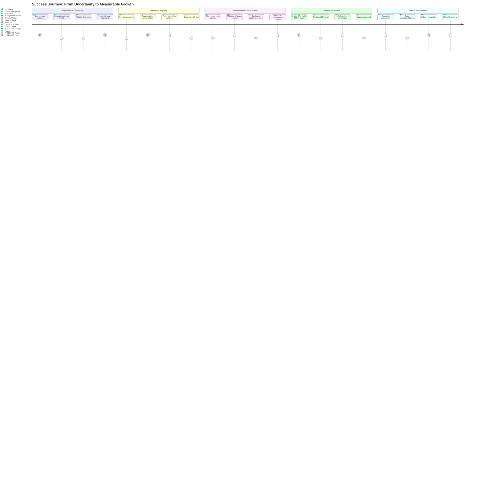

# Epic Success Customer Journey
*From "First Contact" to "Impact KPIs"*

**Epic Reinforcement:** Conveys the step-by-step for the client, and how VIBESHIFT+partners ensure impact and retention at every stage.