# Technical Architecture & Stack
*Full technical vision: from MVP to enterprise scale*

```mermaid
flowchart TB
    subgraph Frontend ["🖥️ Frontend Layer"]
        WebApp[React 18 + TypeScript<br/>🌐 Web Dashboard]
        MobileApp[React Native<br/>📱 Mobile App]
        PWA[Progressive Web App<br/>⚡ Offline Capable]
    end
    
    subgraph Backend ["⚙️ Backend Layer"]
        API[Node.js + Express<br/>🔗 REST/GraphQL API]
        Auth[Supabase Auth<br/>🔐 Multi-tenant Security]
        Database[(PostgreSQL + RLS<br/>📊 Secure Multi-tenant DB)]
        FileStorage[Amazon S3<br/>📁 File Storage]
    end
    
    subgraph AILayer ["🧠 AI & Intelligence"]
        OpenAIAPI[OpenAI GPT-4<br/>💭 Natural Language]
        GeminiAPI[Google Gemini<br/>🔮 Advanced AI]
        CustomML[Custom ML Models<br/>🎯 Vibe Score™]
        VectorDB[Vector Database<br/>🔍 Semantic Search]
    end
    
    subgraph Integrations ["🌐 Integration Layer"]
        RestAPIs[REST APIs<br/>🔗 External Services]
        Webhooks[Webhook Handlers<br/>⚡ Real-time Events]
        OAuth[OAuth 2.0<br/>🔑 Secure Connections]
        RateLimiting[Rate Limiting<br/>⛔ API Protection]
    end
    
    subgraph Automation ["🤖 Automation Layer"]
        n8nWorkflows[n8n Workflows<br/>🔄 Complex Automations]
        ZapierIntegration[Zapier Integration<br/>⚡ Simple Automations]
        CronJobs[Scheduled Jobs<br/>⏰ Background Tasks]
        EventQueue[Event Queue<br/>📥 Async Processing]
    end
    
    subgraph DevOps ["🚀 DevOps & Infrastructure"]
        Docker[Docker Containers<br/>📦 Containerization]
        Railway[Railway Deployment<br/>🚄 Easy Deploy]
        Vercel[Vercel Frontend<br/>⚡ Edge Computing]
        Monitoring[Sentry + Mixpanel<br/>📊 Monitoring & Analytics]
    end
    
    subgraph Security ["🔒 Security Layer"]
        RLS[Row Level Security<br/>🛡️ Data Isolation]
        Encryption[End-to-End Encryption<br/>🔐 Data Protection]
        Compliance[SOC 2 Compliance<br/>✅ Enterprise Ready]
        Backup[Automated Backups<br/>💾 Data Recovery]
    end
    
    WebApp --> API
    MobileApp --> API
    PWA --> API
    
    API --> Auth
    API --> Database
    API --> FileStorage
    
    API --> OpenAIAPI
    API --> GeminiAPI
    API --> CustomML
    CustomML --> VectorDB
    
    API --> RestAPIs
    API --> Webhooks
    RestAPIs --> OAuth
    API --> RateLimiting
    
    EventQueue --> n8nWorkflows
    EventQueue --> ZapierIntegration
    EventQueue --> CronJobs
    
    Docker --> Railway
    Docker --> Vercel
    Railway --> Monitoring
    
    Database --> RLS
    API --> Encryption
    Railway --> Compliance
    Database --> Backup
    
    classDef frontend fill:#61DAFB,stroke:#0066CC,color:#000
    classDef backend fill:#10B981,stroke:#059669,color:#fff
    classDef ai fill:#7C3AED,stroke:#4C1D95,color:#fff
    classDef integrations fill:#F59E0B,stroke:#D97706,color:#000
    classDef automation fill:#EF4444,stroke:#DC2626,color:#fff
    classDef devops fill:#6366F1,stroke:#4F46E5,color:#fff
    classDef security fill:#374151,stroke:#111827,color:#fff
    
    class WebApp,MobileApp,PWA frontend
    class API,Auth,Database,FileStorage backend
    class OpenAIAPI,GeminiAPI,CustomML,VectorDB ai
    class RestAPIs,Webhooks,OAuth,RateLimiting integrations
    class n8nWorkflows,ZapierIntegration,CronJobs,EventQueue automation
    class Docker,Railway,Vercel,Monitoring devops
    class RLS,Encryption,Compliance,Backup security
```

**Epic Reinforcement:** Shows enterprise-grade architecture that scales from MVP to Fortune 500. Every layer designed for security, performance, and infinite scale.