# Susan Keplinger Methodology Platform
*From Susan helps companies to Susan trains an army of growth experts*

```mermaid
graph LR
    subgraph SusanCore ["👩‍💼 Susan's Core Knowledge"]
        Experience[15+ Years Experience<br/>📚 Growth Expertise]
        FoNMethod[Force of Nature<br/>🌩️ 324% Framework]
        GSMethod[Growth Signal<br/>📡 Embedded Consulting]
        CaseStudies[Success Cases<br/>📈 Proven Results]
    end
    
    subgraph AIMethodology ["🤖 AI-Powered Methodology"]
        KnowledgeBase[AI Knowledge Base<br/>🧠 Susan's Brain Digitized]
        DecisionTree[Decision Trees<br/>🌳 Systematic Approach]
        Playbooks[Automated Playbooks<br/>📋 Step-by-Step Guides]
        BestPractices[Best Practices Library<br/>⭐ Curated Excellence]
    end
    
    subgraph TrainingPlatform ["🎓 Training & Certification"]
        OnlineCourses[Online Courses<br/>🖥️ Interactive Learning]
        Certification[Certification Program<br/>🏆 Susan Certified]
        Mentorship[AI Mentorship<br/>🤝 Guided Development]
        CommunityForum[Expert Community<br/>💬 Peer Learning]
    end
    
    subgraph ScaleNetwork ["🌍 Global Scale Network"]
        CertifiedConsultants[Certified Consultants<br/>👥 Global Network]
        FranchiseModel[Franchise Opportunities<br/>🏢 Business Model]
        RevenueShare[Revenue Sharing<br/>💰 Aligned Incentives]
        QualityControl[Quality Assurance<br/>✅ Brand Protection]
    end
    
    subgraph ClientExperience ["💼 Enhanced Client Experience"]
        LocalExperts[Local Certified Experts<br/>🌎 Global Reach]
        ConsistentQuality[Consistent Quality<br/>⚖️ Susan Standard]
        ScaledCapacity[Unlimited Capacity<br/>♾️ No Bottlenecks]
        ContinuousImprovement[Continuous Learning<br/>📊 Data-Driven Evolution]
    end
    
    Experience --> KnowledgeBase
    FoNMethod --> DecisionTree
    GSMethod --> Playbooks
    CaseStudies --> BestPractices
    
    KnowledgeBase --> OnlineCourses
    DecisionTree --> Certification
    Playbooks --> Mentorship
    BestPractices --> CommunityForum
    
    OnlineCourses --> CertifiedConsultants
    Certification --> FranchiseModel
    Mentorship --> RevenueShare
    CommunityForum --> QualityControl
    
    CertifiedConsultants --> LocalExperts
    FranchiseModel --> ConsistentQuality
    RevenueShare --> ScaledCapacity
    QualityControl --> ContinuousImprovement
    
    LocalExperts -.->|"Feedback Loop"| KnowledgeBase
    ConsistentQuality -.->|"Success Data"| CaseStudies
    ScaledCapacity -.->|"Market Insights"| Experience
    ContinuousImprovement -.->|"Methodology Updates"| SusanCore
    
    classDef susan fill:#7C3AED,stroke:#4C1D95,color:#fff
    classDef ai fill:#1E40AF,stroke:#1E3A8A,color:#fff
    classDef training fill:#10B981,stroke:#059669,color:#fff
    classDef scale fill:#F59E0B,stroke:#D97706,color:#000
    classDef experience fill:#EF4444,stroke:#DC2626,color:#fff
    
    class Experience,FoNMethod,GSMethod,CaseStudies susan
    class KnowledgeBase,DecisionTree,Playbooks,BestPractices ai
    class OnlineCourses,Certification,Mentorship,CommunityForum training
    class CertifiedConsultants,FranchiseModel,RevenueShare,QualityControl scale
    class LocalExperts,ConsistentQuality,ScaledCapacity,ContinuousImprovement experience
```

**Epic Vision:** Transform Susan from individual consultant to methodology platform that trains and certifies thousands of growth experts worldwide, each delivering the Susan standard of excellence.