# Developer Network Flywheel
*Demonstrates how developers fuel platform growth via network effects*

```mermaid
flowchart LR
  subgraph Acquisition["🎯 Developer Acquisition"]
    Ads[Targeted Ads<br/>🎯 AI/Tech Communities]
    Referrals[Developer Referrals<br/>🤝 Word of Mouth]
    Events[Hackathons & Meetups<br/>🚀 Tech Events]
    Content[Tech Content Marketing<br/>📝 Thought Leadership]
  end

  subgraph Activation["🚀 Activation & Onboarding"]
    Signup[Quick Signup & Profile<br/>⚡ 2-min Setup]
    VibeScore[Vibe Score™ Assessment<br/>🧠 AI Evaluation]
    TrialProject[First Trial Project<br/>💼 Immediate Value]
    Mentorship[AI-Powered Mentorship<br/>🤖 Guided Growth]
  end

  subgraph Engagement["💡 Engagement & Value Creation"]
    Projects[Active Project Matching<br/>🎯 Perfect Fit Jobs]
    Feedback[Peer Review System<br/>⭐ Quality Assurance]
    Reputation[Reputation Building<br/>🏆 Achievement System]
    Community[Developer Community<br/>👥 Peer Network]
  end

  subgraph NetworkEffect["🌐 Network Effect Amplification"]
    Invites[Invite Elite Friends<br/>🎁 Bonus Rewards]
    CaseStudies[Success Story Sharing<br/>📈 Public Recognition]
    Testimonials[Client Testimonials<br/>💬 Social Proof]
    Growth[Community Growth<br/>📊 Exponential Scale]
  end

  subgraph Retention["🔄 Long-term Retention"]
    PremiumProjects[Premium Project Access<br/>💎 Elite Opportunities]
    SkillDevelopment[Continuous Learning<br/>📚 Skill Evolution]
    RevenueGrowth[Revenue Growth<br/>💰 Higher Earnings]
    Leadership[Thought Leadership<br/>🎤 Industry Recognition]
  end

  Ads --> Signup
  Referrals --> Signup
  Events --> Signup
  Content --> Signup

  Signup --> VibeScore
  VibeScore --> TrialProject
  TrialProject --> Mentorship
  Mentorship --> Projects

  Projects --> Feedback
  Feedback --> Reputation
  Reputation --> Community
  Community --> Invites

  Invites --> CaseStudies
  CaseStudies --> Testimonials
  Testimonials --> Growth
  Growth --> PremiumProjects

  PremiumProjects --> SkillDevelopment
  SkillDevelopment --> RevenueGrowth
  RevenueGrowth --> Leadership
  Leadership --> Referrals

  Growth -.->|"More Opportunities"| Projects
  Leadership -.->|"Attracts Talent"| Events
  RevenueGrowth -.->|"Success Stories"| Content

  classDef acquisition fill:#FF6B35,stroke:#DC2626,color:#fff
  classDef activation fill:#1E40AF,stroke:#1E3A8A,color:#fff
  classDef engagement fill:#10B981,stroke:#059669,color:#fff
  classDef network fill:#7C3AED,stroke:#4C1D95,color:#fff
  classDef retention fill:#F59E0B,stroke:#D97706,color:#000

  class Ads,Referrals,Events,Content acquisition
  class Signup,VibeScore,TrialProject,Mentorship activation
  class Projects,Feedback,Reputation,Community engagement
  class Invites,CaseStudies,Testimonials,Growth network
  class PremiumProjects,SkillDevelopment,RevenueGrowth,Leadership retention
```

**Epic Network Effect:** Each successful developer becomes a magnet for more elite talent, creating an unstoppable growth flywheel that compounds exponentially.