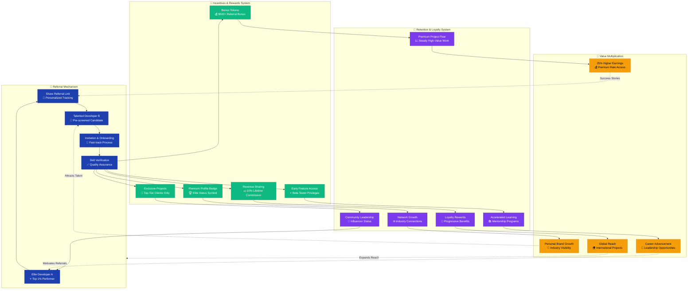

# Referral & Incentive Loop
*Shows how incentives drive developer referrals and retention*

**Epic Incentive Design:** Creates a self-reinforcing loop where successful developers become powerful advocates, driving exponential network growth through aligned incentives and shared value creation.