# Community Amplification & Network Effect
*Illustrates how community activities amplify growth network-wide*

```mermaid
flowchart TB
  subgraph Community["👥 Developer Community Hub"]
    Forum[AI/Tech Discussion Forums<br/>💬 Knowledge Sharing]
    Meetups[Virtual & Live Meetups<br/>🤝 Networking Events]
    Webinars[Expert-led Webinars<br/>🎓 Continuous Learning]
    OpenSource[Open Source Contributions<br/>🔓 Collaborative Projects]
    Hackathons[Monthly Hackathons<br/>🏆 Innovation Challenges]
  end

  subgraph ContentCreation["📝 Content & Thought Leadership"]
    TechBlog[Developer Tech Blog<br/>📖 Industry Insights]
    VideoTutorials[Video Tutorial Series<br/>🎥 Skill Development]
    CaseStudies[Success Story Publications<br/>📈 Proven Results]
    Podcasts[Developer Podcast Series<br/>🎙️ Industry Discussions]
    Whitepapers[Technical Whitepapers<br/>📄 Deep Dive Analysis]
  end

  subgraph AmplificationChannels["📣 Multi-Channel Amplification"]
    TwitterThreads[Twitter/X Viral Threads<br/>🐦 Real-time Engagement]
    LinkedInPosts[LinkedIn Thought Leadership<br/>💼 Professional Network]
    YouTubeContent[YouTube Tech Channel<br/>📺 Visual Learning]
    DevCommunities[Dev.to, Reddit, HN<br/>🌐 Developer Platforms]
    TechConferences[Conference Speaking<br/>🎤 Industry Events]
  end

  subgraph NetworkGrowthMetrics["🌐 Exponential Growth Metrics"]
    NewDeveloperSignups[Developer Signups ↗️<br/>📊 +40% Monthly Growth]
    EngagementRate[Community Engagement ↗️<br/>⚡ 85% Active Users]
    ProjectSubmissions[Project Applications ↗️<br/>🎯 +60% Quality Matches]
    RetentionRate[Developer Retention ↗️<br/>🔄 92% 6-month Retention]
    ReferralVelocity[Referral Velocity ↗️<br/>🚀 3.2x Network Effect]
  end

  subgraph ViraLityEngine["🔥 Virality & Social Proof"]
    SuccessStories[Developer Success Stories<br/>⭐ Authentic Testimonials]
    EarningsReports[Public Earnings Reports<br/>💰 Transparent Results]
    ClientTestimonials[Client Success Reviews<br/>💬 Social Validation]
    IndustryRecognition[Industry Awards & Recognition<br/>🏆 Credibility Boost]
    MediaCoverage[Tech Media Coverage<br/>📰 PR Amplification]
  end

  Forum --> TechBlog
  Meetups --> VideoTutorials
  Webinars --> CaseStudies
  OpenSource --> Whitepapers
  Hackathons --> Podcasts

  TechBlog --> TwitterThreads
  VideoTutorials --> YouTubeContent
  CaseStudies --> LinkedInPosts
  Podcasts --> DevCommunities
  Whitepapers --> TechConferences

  TwitterThreads --> NewDeveloperSignups
  LinkedInPosts --> EngagementRate
  YouTubeContent --> ProjectSubmissions
  DevCommunities --> RetentionRate
  TechConferences --> ReferralVelocity

  NewDeveloperSignups --> SuccessStories
  EngagementRate --> EarningsReports
  ProjectSubmissions --> ClientTestimonials
  RetentionRate --> IndustryRecognition
  ReferralVelocity --> MediaCoverage

  SuccessStories -.->|"Attracts Talent"| Community
  EarningsReports -.->|"Builds Credibility"| ContentCreation
  ClientTestimonials -.->|"Social Proof"| AmplificationChannels
  IndustryRecognition -.->|"Authority Building"| ViraLityEngine
  MediaCoverage -.->|"Amplifies Reach"| NetworkGrowthMetrics

  classDef community fill:#10B981,stroke:#059669,color:#fff
  classDef content fill:#1E40AF,stroke:#1E3A8A,color:#fff
  classDef amplification fill:#7C3AED,stroke:#4C1D95,color:#fff
  classDef growth fill:#F59E0B,stroke:#D97706,color:#000
  classDef viral fill:#EF4444,stroke:#DC2626,color:#fff

  class Forum,Meetups,Webinars,OpenSource,Hackathons community
  class TechBlog,VideoTutorials,CaseStudies,Podcasts,Whitepapers content
  class TwitterThreads,LinkedInPosts,YouTubeContent,DevCommunities,TechConferences amplification
  class NewDeveloperSignups,EngagementRate,ProjectSubmissions,RetentionRate,ReferralVelocity growth
  class SuccessStories,EarningsReports,ClientTestimonials,IndustryRecognition,MediaCoverage viral
```

**Epic Community Strategy:** Every piece of content, every community interaction, and every success story becomes fuel for exponential network growth, creating a self-sustaining ecosystem of growth and innovation.