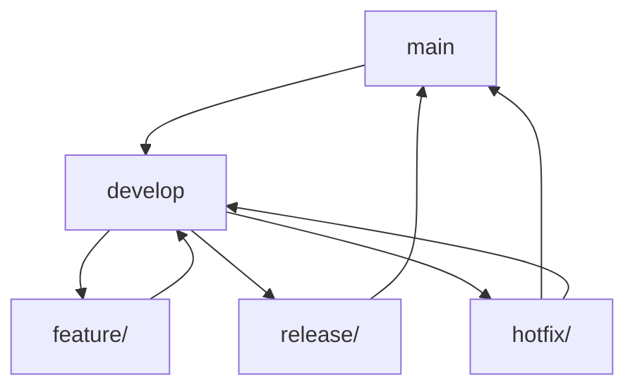

# Git Workflow

Estrategia completa de Git para equipos, con branching strategy, commit conventions y automatización.

## Pre-requisitos
- Git configurado con user.name y user.email
- Repositorio inicializado
- Equipo alineado en la estrategia
- CI/CD configurado para branches principales

## Pasos del Workflow

### 1. Configuración Inicial de Git
```bash
# Configuración global
git config --global user.name "Tu Nombre"
git config --global user.email "tu.email@empresa.com"

# Configuración del repositorio
git config core.autocrlf input  # Para Linux/Mac
# o
git config core.autocrlf true   # Para Windows

# Configurar push default
git config --global push.default simple

# Aliases útiles
git config --global alias.co checkout
git config --global alias.br branch
git config --global alias.ci commit
git config --global alias.st status
git config --global alias.unstage 'reset HEAD --'
git config --global alias.last 'log -1 HEAD'
git config --global alias.visual '!gitk'
```

### 2. Estrategia de Branching - GitFlow


#### Branches Principales:
- **`main`**: Código de producción estable
- **`develop`**: Desarrollo activo, integra features completadas

#### Branches de Soporte:
- **`feature/*`**: Nuevas funcionalidades
- **`release/*`**: Preparación de releases
- **`hotfix/*`**: Corrección de bugs en producción

### 3. Convenciones de Commits
```markdown
## Formato de Commit Messages

```
<type>[optional scope]: <description>

[optional body]

[optional footer(s)]
```

### Tipos de Commit:
- **feat**: Nueva funcionalidad
- **fix**: Corrección de bug
- **docs**: Cambios en documentación
- **style**: Cambios de estilo (formatting, etc.)
- **refactor**: Refactoring de código
- **test**: Agregar o corregir tests
- **chore**: Cambios en build, config, etc.

### Ejemplos:
```
feat: add user authentication system
fix: resolve memory leak in image processing
docs: update API documentation for v2.0
style: format code with prettier
refactor: extract validation logic to separate module
test: add unit tests for user service
chore: update dependencies to latest versions
```

### Breaking Changes:
```
feat!: remove deprecated API endpoints

BREAKING CHANGE: The /api/v1/users endpoint has been removed.
Use /api/v2/users instead.
```

### Issues/Tickets:
```
feat: implement user profile page

Closes #123
Related to #456
```
```

### 4. Workflow para Features
```bash
# 1. Crear branch desde develop
git checkout develop
git pull origin develop
git checkout -b feature/user-authentication

# 2. Trabajar en la feature
# ... hacer commits siguiendo convenciones ...

# 3. Mantener branch actualizado
git fetch origin
git rebase origin/develop

# 4. Crear Pull Request cuando esté listo
# - Push del branch
# - Crear PR en GitHub/GitLab
# - Esperar code review y approval

# 5. Merge (usando squash o merge commit)
git checkout develop
git merge feature/user-authentication --no-ff
git push origin develop

# 6. Limpiar branch
git branch -d feature/user-authentication
git push origin --delete feature/user-authentication
```

### 5. Workflow para Releases
```bash
# 1. Crear branch de release
git checkout develop
git pull origin develop
git checkout -b release/v1.2.0

# 2. Preparar release
# - Actualizar versión en package.json
# - Actualizar CHANGELOG.md
# - Ejecutar tests finales
# - Build de producción

# 3. Merge a main
git checkout main
git merge release/v1.2.0 --no-ff
git tag -a v1.2.0 -m "Release version 1.2.0"
git push origin main --tags

# 4. Merge de vuelta a develop
git checkout develop
git merge release/v1.2.0 --no-ff
git push origin develop

# 5. Limpiar
git branch -d release/v1.2.0
git push origin --delete release/v1.2.0
```

### 6. Workflow para Hotfixes
```bash
# 1. Crear hotfix desde main
git checkout main
git pull origin main
git checkout -b hotfix/critical-security-fix

# 2. Implementar fix
# - Corregir el bug crítico
# - Agregar tests si es necesario

# 3. Merge a main
git checkout main
git merge hotfix/critical-security-fix --no-ff
git tag -a v1.1.1 -m "Hotfix: Critical security fix"
git push origin main --tags

# 4. Merge a develop
git checkout develop
git merge hotfix/critical-security-fix --no-ff
git push origin develop

# 5. Limpiar
git branch -d hotfix/critical-security-fix
git push origin --delete hotfix/critical-security-fix
```

### 7. Automatización con Hooks
```bash
# Instalar Husky para Git hooks
npm install --save-dev husky
npx husky install

# Crear hooks
```

#### pre-commit hook:
```bash
#!/bin/sh
. "$(dirname "$0")/_/husky.sh"

# Ejecutar linting
npm run lint

# Ejecutar tests
npm run test

# Verificar que no hay console.logs
npx eslint src/ --ext .js,.ts,.tsx --rule 'no-console: error'
```

#### commit-msg hook:
```bash
#!/bin/sh
. "$(dirname "$0")/_/husky.sh"

# Validar formato de commit message
npx commitlint --edit $1
```

#### pre-push hook:
```bash
#!/bin/sh
. "$(dirname "$0")/_/husky.sh"

# Ejecutar tests completos
npm run test:ci

# Verificar build
npm run build

# Ejecutar linting
npm run lint
```

### 8. Configuración de CommitLint
```javascript
// .commitlintrc.js
module.exports = {
  extends: ['@commitlint/config-conventional'],
  rules: {
    'type-enum': [
      2,
      'always',
      [
        'build',
        'chore',
        'ci',
        'docs',
        'feat',
        'fix',
        'perf',
        'refactor',
        'revert',
        'style',
        'test'
      ]
    ],
    'subject-case': [2, 'always', 'lower-case'],
    'subject-empty': [2, 'never'],
    'subject-full-stop': [2, 'never', '.'],
    'header-max-length': [2, 'always', 72]
  }
}
```

### 9. Scripts de Automatización
```javascript
// scripts/git-workflow.js
const { execSync } = require('child_process')

class GitWorkflow {
  // Crear nueva feature branch
  createFeatureBranch(name) {
    const branchName = `feature/${name.toLowerCase().replace(/\s+/g, '-')}`
    execSync(`git checkout -b ${branchName}`)
    console.log(`✅ Created feature branch: ${branchName}`)
    return branchName
  }

  // Preparar release
  prepareRelease(version) {
    const releaseBranch = `release/v${version}`

    // Crear branch de release
    execSync(`git checkout -b ${releaseBranch}`)

    // Actualizar package.json
    this.updateVersion(version)

    // Actualizar CHANGELOG
    this.updateChangelog(version)

    console.log(`✅ Prepared release: ${version}`)
    return releaseBranch
  }

  // Merge feature a develop
  mergeFeatureToDevelop(featureBranch) {
    execSync('git checkout develop')
    execSync('git pull origin develop')
    execSync(`git merge ${featureBranch} --no-ff`)
    execSync('git push origin develop')

    // Limpiar branch
    execSync(`git branch -d ${featureBranch}`)
    execSync(`git push origin --delete ${featureBranch}`)

    console.log(`✅ Merged ${featureBranch} to develop`)
  }

  // Crear hotfix
  createHotfix(description) {
    const timestamp = new Date().toISOString().slice(0, 10)
    const branchName = `hotfix/${description.toLowerCase().replace(/\s+/g, '-')}-${timestamp}`

    execSync('git checkout main')
    execSync('git pull origin main')
    execSync(`git checkout -b ${branchName}`)

    console.log(`✅ Created hotfix branch: ${branchName}`)
    return branchName
  }

  updateVersion(version) {
    const fs = require('fs')
    const packageJson = JSON.parse(fs.readFileSync('package.json', 'utf8'))
    packageJson.version = version
    fs.writeFileSync('package.json', JSON.stringify(packageJson, null, 2))
    execSync('git add package.json')
    execSync(`git commit -m "chore: bump version to ${version}"`)
  }

  updateChangelog(version) {
    const fs = require('fs')
    let changelog = fs.readFileSync('CHANGELOG.md', 'utf8')

    const today = new Date().toISOString().slice(0, 10)
    const newEntry = `## [${version}] - ${today}\n\n### Added\n- \n\n### Changed\n- \n\n### Fixed\n- \n\n`

    changelog = changelog.replace('# Changelog\n', `# Changelog\n\n${newEntry}`)
    fs.writeFileSync('CHANGELOG.md', changelog)
  }

  // Validar estado del repositorio
  validateRepo() {
    const issues = []

    // Verificar que estamos en branch correcto
    const currentBranch = execSync('git rev-parse --abbrev-ref HEAD', { encoding: 'utf8' }).trim()
    console.log(`Current branch: ${currentBranch}`)

    // Verificar estado limpio
    const status = execSync('git status --porcelain', { encoding: 'utf8' })
    if (status) {
      issues.push('Working directory is not clean')
    }

    // Verificar commits pendientes
    try {
      execSync('git fetch origin')
      const behind = execSync(`git rev-list HEAD...origin/${currentBranch} --count`, { encoding: 'utf8' }).trim()
      if (parseInt(behind) > 0) {
        issues.push(`Branch is ${behind} commits behind origin`)
      }
    } catch (error) {
      // Branch might not exist on remote yet
    }

    if (issues.length > 0) {
      console.log('⚠️  Repository validation issues:')
      issues.forEach(issue => console.log(`  - ${issue}`))
      return false
    }

    console.log('✅ Repository is in good state')
    return true
  }
}

// CLI interface
const args = process.argv.slice(2)
const command = args[0]
const workflow = new GitWorkflow()

switch (command) {
  case 'feature':
    workflow.createFeatureBranch(args[1])
    break
  case 'release':
    workflow.prepareRelease(args[1])
    break
  case 'hotfix':
    workflow.createHotfix(args.slice(1).join(' '))
    break
  case 'validate':
    workflow.validateRepo()
    break
  default:
    console.log('Usage: node git-workflow.js <command> [args]')
    console.log('Commands: feature <name>, release <version>, hotfix <description>, validate')
}
```

### 10. CI/CD Integration
```yaml
# .github/workflows/git-flow.yml
name: Git Flow Validation
on:
  push:
    branches: [main, develop]
  pull_request:
    branches: [main, develop]

jobs:
  validate-commits:
    runs-on: ubuntu-latest
    steps:
      - uses: actions/checkout@v3
        with:
          fetch-depth: 0

      - name: Setup Node.js
        uses: actions/setup-node@v3
        with:
          node-version: '18'

      - name: Install dependencies
        run: npm ci

      - name: Validate commit messages
        run: npx commitlint --from HEAD~1 --to HEAD --verbose

  validate-branching:
    runs-on: ubuntu-latest
    steps:
      - uses: actions/checkout@v3

      - name: Validate branch naming
        run: |
          BRANCH_NAME="${{ github.head_ref }}"
          if [[ "$BRANCH_NAME" =~ ^(feature|bugfix|hotfix|release)/ ]]; then
            echo "✅ Branch name follows convention: $BRANCH_NAME"
          else
            echo "❌ Branch name should follow pattern: feature/*, bugfix/*, hotfix/*, release/*"
            exit 1
          fi

  validate-pr:
    runs-on: ubuntu-latest
    if: github.event_name == 'pull_request'
    steps:
      - uses: actions/checkout@v3

      - name: Validate PR title
        run: |
          PR_TITLE="${{ github.event.pull_request.title }}"
          if [[ "$PR_TITLE" =~ ^(feat|fix|docs|style|refactor|test|chore)(\(.+\))?: ]]; then
            echo "✅ PR title follows conventional commits: $PR_TITLE"
          else
            echo "❌ PR title should follow conventional commits format"
            exit 1
          fi
```

### 11. Guías de Troubleshooting
```markdown
## Problemas Comunes y Soluciones

### Merge Conflicts:
```bash
# Actualizar branch local
git fetch origin
git rebase origin/develop

# Resolver conflictos manualmente
# Luego continuar rebase
git add <archivos-resueltos>
git rebase --continue

# Si hay muchos conflictos, abortar y hacer merge
git rebase --abort
git merge origin/develop
```

### Commits en Branch Equivocado:
```bash
# Mover commits a nuevo branch
git branch nueva-feature
git reset --hard HEAD~3  # Eliminar últimos 3 commits
git checkout nueva-feature  # Ir al nuevo branch con commits
```

### Revertir Commits:
```bash
# Revertir último commit (crea nuevo commit)
git revert HEAD

# Revertir múltiples commits
git revert HEAD~3..HEAD

# Reset a commit anterior (¡PELIGROSO!)
git reset --hard <commit-hash>
```

### Limpiar Branches Locales:
```bash
# Ver branches merged
git branch --merged develop

# Eliminar branches locales merged
git branch --merged develop | grep -v develop | xargs git branch -d

# Eliminar branches remotas que ya no existen
git fetch --prune
```
```

### 12. Métricas y Monitoreo
```javascript
// scripts/git-metrics.js
const { execSync } = require('child_process')

class GitMetrics {
  getCommitStats(days = 30) {
    const since = `${days} days ago`

    // Commits por autor
    const authorStats = execSync(`git log --since="${since}" --pretty=format:"%an" | sort | uniq -c | sort -nr`, { encoding: 'utf8' })

    // Commits por día
    const dailyStats = execSync(`git log --since="${since}" --date=short --pretty=format:"%ad" | sort | uniq -c`, { encoding: 'utf8' })

    // Tipos de commits
    const commitTypes = execSync(`git log --since="${since}" --pretty=format:"%s" | grep -E "^(feat|fix|docs|style|refactor|test|chore)" | cut -d: -f1 | sort | uniq -c | sort -nr`, { encoding: 'utf8' })

    console.log('📊 Git Metrics:')
    console.log(`\nCommits by author (${days} days):`)
    console.log(authorStats)

    console.log(`\nDaily commits (${days} days):`)
    console.log(dailyStats)

    console.log('\nCommit types:')
    console.log(commitTypes)
  }

  getBranchHealth() {
    // Branches sin merge
    const staleBranches = execSync('git branch --no-merged develop | head -10', { encoding: 'utf8' })

    // Branches con muchos commits
    const largeBranches = execSync('for branch in $(git branch --no-merged develop | sed "s/*//"); do echo "$branch $(git rev-list --count develop..$branch)"; done | sort -k2 -nr | head -5', { encoding: 'utf8' })

    console.log('🍂 Stale branches:')
    console.log(staleBranches)

    console.log('\n📏 Large branches:')
    console.log(largeBranches)
  }

  getCodeChurn() {
    // Líneas cambiadas por archivo
    const churnStats = execSync('git log --since="30 days ago" --pretty=format: --numstat | awk \'{insert+=$1; delete+=$2} END {print "Inserted:", insert, "Deleted:", delete, "Total:", insert+delete}\'', { encoding: 'utf8' })

    console.log('\n📈 Code churn (30 days):')
    console.log(churnStats)
  }
}

// Ejecutar métricas
const metrics = new GitMetrics()
metrics.getCommitStats()
metrics.getBranchHealth()
metrics.getCodeChurn()
```

### 13. Mejores Prácticas
- **Commits pequeños y frecuentes**: Fácil de revisar y revertir
- **Branches cortos**: Mantener features pequeñas y enfocadas
- **Pull requests temprano**: Obtener feedback temprano
- **Code review obligatorio**: Todos los cambios requieren revisión
- **Merge regular**: Evitar branches demasiado antiguos
- **Limpieza regular**: Eliminar branches merged
- **Documentación**: README con estrategia del equipo

### 14. Recursos Adicionales
- [GitFlow Workflow](https://nvie.com/posts/a-successful-git-branching-model/)
- [Conventional Commits](https://conventionalcommits.org/)
- [Git Best Practices](https://sethrobertson.github.io/GitBestPractices/)
- [Oh Shit, Git!](https://ohshitgit.com/)
