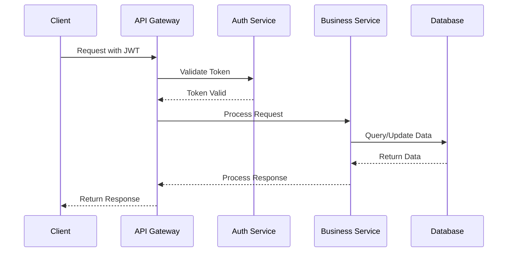
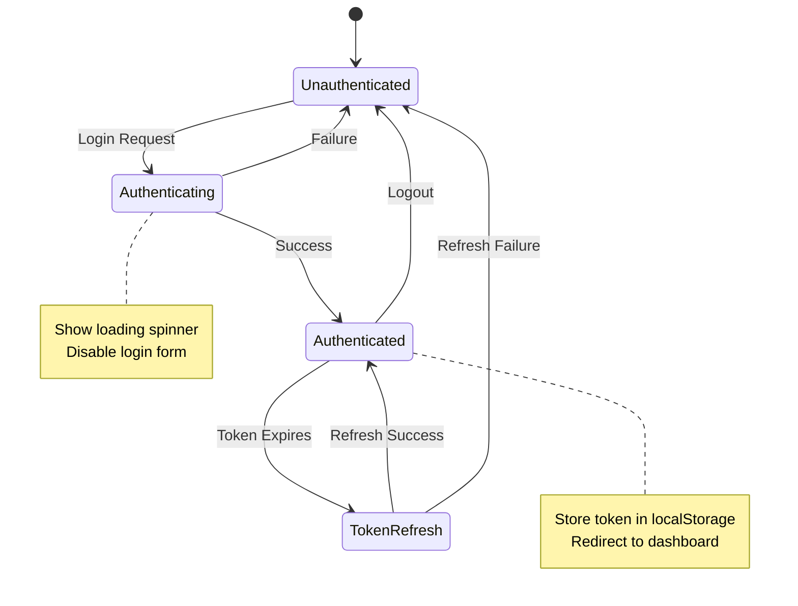

# Documentation — API Documentation & Endpoints

Documenta automáticamente todas las APIs, endpoints, tipos de datos y ejemplos de uso para el frontend y backend.

Related: `/documentation/architecture-diagrams`, `/documentation/data-flow-diagrams`

## Objetivo
Crear documentación completa de APIs con:
- Endpoints REST/GraphQL documentados
- Tipos de datos TypeScript
- Ejemplos de requests/responses
- Estados de autenticación
- Diagramas de flujo de API

## Entradas
- Archivo de configuración de API: `src/lib/api.ts` o similar
- Contextos de autenticación: `src/contexts/AuthContext.tsx`
- Tipos de API: `src/types/api.ts`
- Documento existente: `API.md`

## Preflight (Windows PowerShell) — seguro para auto‑ejecutar
// turbo
```powershell
$paths = @('docs/api','docs/endpoints','project-logs/api')
$paths | ForEach-Object { if (!(Test-Path $_)) { New-Item -ItemType Directory -Path $_ | Out-Null } }
```

## Pasos

### 1) Análisis de Endpoints
Escanea el código para identificar:
- Funciones de API en `src/lib/`
- Endpoints utilizados en componentes
- Métodos HTTP (GET, POST, PUT, DELETE)
- Parámetros y headers requeridos

### 2) Documentación de Endpoints Principales
Para cada endpoint encontrado, genera:
```markdown
## [Endpoint Name]

### Descripción
Breve descripción del propósito del endpoint.

### URL
```
GET /api/v1/[resource]
```

### Parámetros
| Parámetro | Tipo | Requerido | Descripción |
|-----------|------|-----------|-------------|
| param1 | string | Sí | Descripción del parámetro |

### Headers
| Header | Valor | Descripción |
|--------|-------|-------------|
| Authorization | Bearer {token} | Token JWT de autenticación |
| Content-Type | application/json | Tipo de contenido |

### Request Body
```json
{
  "field1": "value1",
  "field2": "value2"
}
```

### Response (200 OK)
```json
{
  "success": true,
  "data": {
    "id": 123,
    "name": "Example"
  }
}
```

### Response (400 Bad Request)
```json
{
  "success": false,
  "error": "Validation error",
  "details": ["Field is required"]
}
```

### Ejemplo de Uso
```typescript
const response = await api.get('/api/v1/resource', {
  headers: {
    'Authorization': `Bearer ${token}`
  }
});
```
```

### 3) Diagrama de Arquitectura de API
Genera diagrama de flujo de API:


### 4) Tipos TypeScript de API
Documenta interfaces y tipos:
```typescript
// Request Types
export interface LoginRequest {
  email: string;
  password: string;
}

export interface CreateProjectRequest {
  name: string;
  description?: string;
  technologies: string[];
}

// Response Types
export interface ApiResponse<T> {
  success: boolean;
  data?: T;
  error?: string;
  message?: string;
}

export interface Project {
  id: string;
  name: string;
  description: string;
  technologies: string[];
  createdAt: string;
  updatedAt: string;
}
```

### 5) Estados de Autenticación
Documenta flujo de auth:


### 6) Índice de APIs
Crea `docs/api/README.md` con:
- Lista completa de endpoints organizados por módulo
- Estados de documentación
- Estadísticas de cobertura

## Artefactos
- `docs/api/[endpoint].md` — Documentación individual de endpoints
- `docs/api/README.md` — Índice de APIs
- `docs/api/types.ts` — Tipos TypeScript generados
- `docs/endpoints/flow-diagrams.md` — Diagramas de flujo
- `project-logs/api/endpoints-analysis.json` — Análisis de endpoints

## Status JSON (ejemplo)
```json
{
  "totalEndpoints": 24,
  "documentedEndpoints": 18,
  "apiModules": ["auth", "projects", "users", "analytics"],
  "authFlows": 3,
  "typescriptTypes": 15,
  "status": "progress",
  "artifacts": [
    "docs/api/README.md",
    "docs/api/types.ts",
    "docs/endpoints/flow-diagrams.md"
  ],
  "timestamp": "${ISO_TIMESTAMP}"
}
```

## Aceptación (Done)
- 100% de endpoints documentados
- Tipos TypeScript generados automáticamente
- Ejemplos de uso funcionales
- Diagramas de flujo de autenticación
- Estados de error documentados

## Dry‑run
- `--dryRun` analiza código sin generar archivos
- Muestra endpoints encontrados y faltantes
