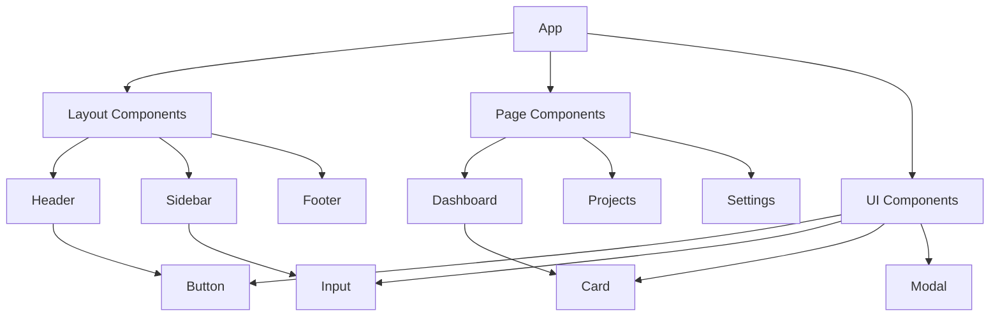

# Documentation — Component Architecture & React Docs

Auto-genera documentación completa de componentes React con diagramas de arquitectura, props, estado y dependencias.

Related: `/documentation/api-docs`, `/documentation/architecture-diagrams`, `/design-and-styling`

## Objetivo
Documentar sistemáticamente todos los componentes React del proyecto con:
- Arquitectura de componentes con diagramas Mermaid
- Props y tipos TypeScript
- Estado interno y gestión de estado
- Dependencias y hooks utilizados
- Casos de uso y ejemplos

## Entradas
- Estructura de componentes: `src/components/`
- Contextos: `src/contexts/`
- Hooks personalizados: `src/hooks/`
- Tipos: `src/types/`

## Preflight (Windows PowerShell) — seguro para auto‑ejecutar
// turbo
```powershell
$paths = @('docs/components','docs/diagrams','project-logs/docs')
$paths | ForEach-Object { if (!(Test-Path $_)) { New-Item -ItemType Directory -Path $_ | Out-Null } }
```

## Pasos

### 1) Análisis de Estructura de Componentes
- Escanea `src/components/` para identificar jerarquía
- Clasifica componentes por tipo: UI, Layout, Business Logic
- Identifica componentes compuestos vs. atómicos

### 2) Generación de Documentación por Componente
Para cada componente encontrado, genera:
```markdown
## [ComponentName]

### Descripción
Breve descripción del propósito del componente.

### Props
| Prop | Tipo | Default | Descripción |
|------|------|---------|-------------|
| propName | TypeScriptType | defaultValue | Descripción detallada |

### Estado Interno
- `useState` variables y su propósito
- Estado derivado de props
- Efectos secundarios

### Dependencias
- Hooks utilizados (useEffect, useCallback, etc.)
- Contextos consumidos
- Utilidades importadas

### Ejemplo de Uso
```tsx
<ComponentName
  prop1={value1}
  prop2={value2}
>
  Children content
</ComponentName>
```
```

### 3) Diagrama de Arquitectura de Componentes
Genera diagrama Mermaid mostrando:


### 4) Análisis de Componentes Críticos
Para componentes complejos (>200 líneas):
- Diagrama de flujo de estado interno
- Análisis de rendimiento (memo, callbacks)
- Testing coverage sugerido

### 5) Generación de Índice de Componentes
Crea `docs/components/README.md` con:
- Tabla de contenidos organizada por categoría
- Estadísticas: total de componentes, líneas de código
- Estado de documentación (completado/pendiente)

## Artefactos
- `docs/components/[ComponentName].md` — Documentación individual
- `docs/components/README.md` — Índice y estadísticas
- `docs/diagrams/component-architecture.md` — Diagrama principal
- `project-logs/docs/component-analysis.json` — Análisis machine-readable

## Status JSON (ejemplo)
```json
{
  "totalComponents": 74,
  "documentedComponents": 45,
  "complexComponents": 12,
  "diagramsGenerated": 8,
  "categories": {
    "ui": 49,
    "layout": 15,
    "business": 10
  },
  "status": "progress",
  "artifacts": [
    "docs/components/README.md",
    "docs/diagrams/component-architecture.md"
  ],
  "timestamp": "${ISO_TIMESTAMP}"
}
```

## Aceptación (Done)
- 100% de componentes documentados
- Diagramas Mermaid funcionales
- Props documentados con tipos TypeScript
- Casos de uso y ejemplos incluidos

## Dry‑run
- `--dryRun` analiza sin generar archivos
- Muestra estadísticas y componentes faltantes
