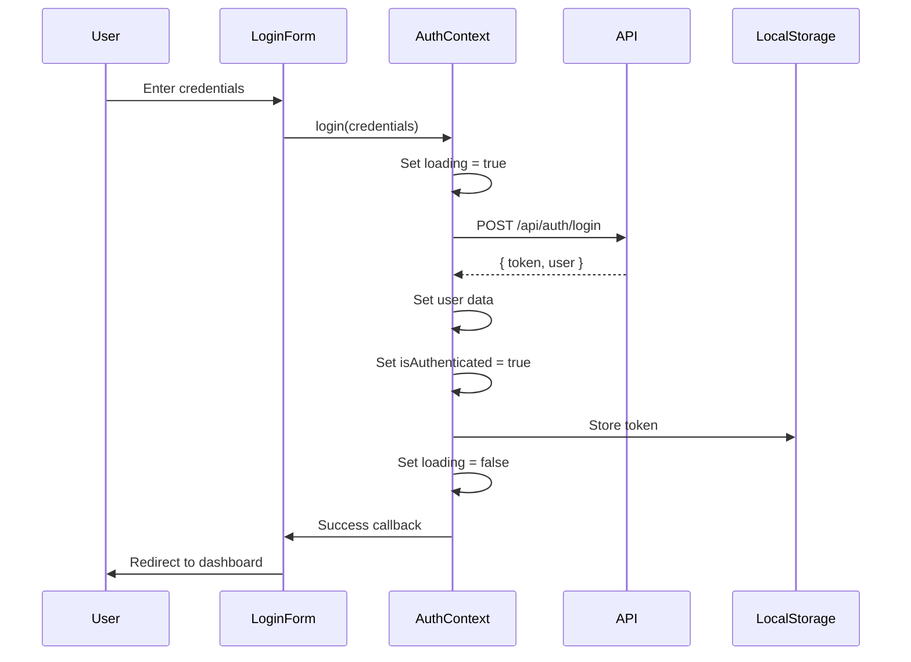
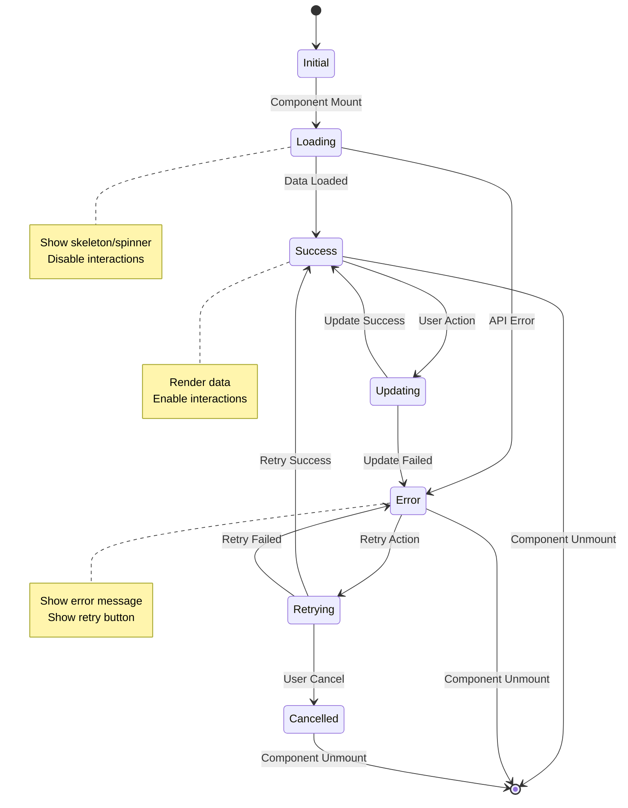
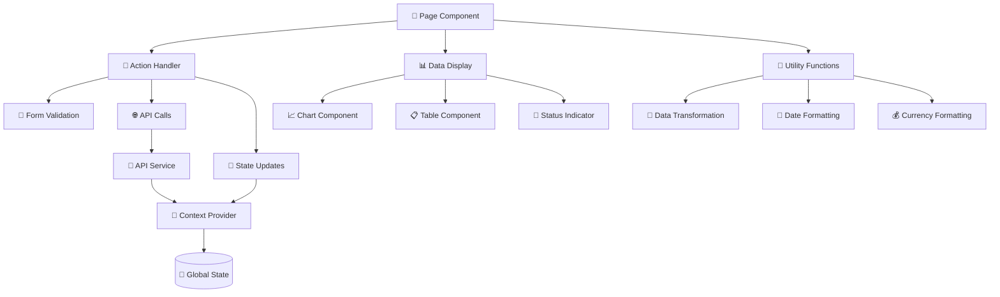
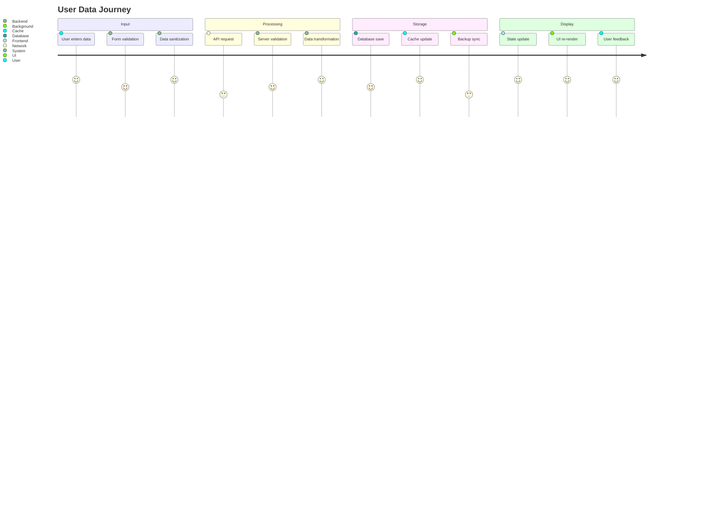
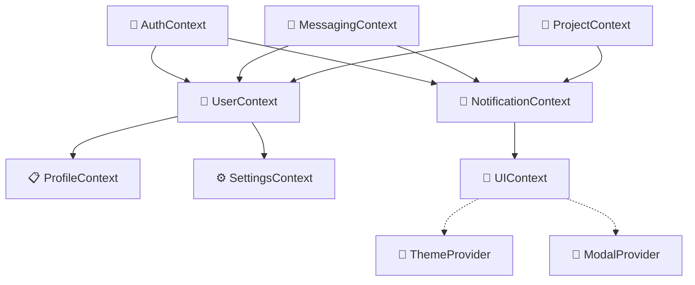

# Documentation — Data Flow & State Diagrams

Crea diagramas visuales que muestran cómo fluyen los datos a través de la aplicación, cambios de estado y relaciones entre componentes.

Related: `/documentation/architecture-diagrams`, `/documentation/component-docs`

## Objetivo
Visualizar el flujo completo de datos con:
- Diagramas de flujo de datos entre componentes
- Gestión de estado global y local
- Ciclo de vida de los datos
- Relaciones entre contextos y stores

## Entradas
- Contextos React: `src/contexts/`
- Componentes con estado: `src/components/`
- Hooks personalizados: `src/hooks/`
- Utilidades de estado: `src/lib/`

## Preflight (Windows PowerShell) — seguro para auto‑ejecutar
// turbo
```powershell
$paths = @('docs/data-flow','docs/state','project-logs/data-flow')
$paths | ForEach-Object { if (!(Test-Path $_)) { New-Item -ItemType Directory -Path $_ | Out-Null } }
```

## Pasos

### 1) Análisis de Flujo de Datos
Identifica patrones de flujo de datos:
- Props drilling vs Context API
- Estado local vs global
- Comunicación entre componentes
- Persistencia de datos (localStorage, sessionStorage)

### 2) Diagrama de Arquitectura de Estado Global
Muestra cómo se estructura el estado global:
```mermaid
graph TD
    App[🏗️ App Root] --> Contexts[📱 React Contexts]

    Contexts --> AuthContext[🔐 AuthContext<br/>- user: User<br/>- isAuthenticated: boolean<br/>- loading: boolean]
    Contexts --> MessagingContext[💬 MessagingContext<br/>- messages: Message[]<br/>- activeChat: string<br/>- unreadCount: number]
    Contexts --> NotificationContext[🔔 NotificationContext<br/>- notifications: Notification[]<br/>- settings: NotificationSettings]

    AuthContext --> AuthProvider[AuthProvider<br/>- login()<br/>- logout()<br/>- refreshToken()]
    MessagingContext --> MessagingProvider[MessagingProvider<br/>- sendMessage()<br/>- markAsRead()<br/>- loadChat()]
    NotificationContext --> NotificationProvider[NotificationProvider<br/>- addNotification()<br/>- removeNotification()<br/>- updateSettings()]

    AuthProvider -.-> LocalStorage[(💾 localStorage<br/>'auth_token')]
    MessagingProvider -.-> SessionStorage[(💻 sessionStorage<br/>'active_chat')]
    NotificationProvider -.-> LocalStorage
```

### 3) Diagrama de Flujo de Autenticación
Secuencia completa de login/logout:


### 4) Diagrama de Estado de Componentes
Muestra estado local en componentes clave:


### 5) Diagrama de Props Flow
Visualiza cómo pasan las props entre componentes:


### 6) Diagrama de Ciclo de Vida de Datos
Muestra el journey completo de los datos:


### 7) Diagrama de Relaciones entre Contextos
Muestra interdependencias entre contextos:


## Artefactos
- `docs/data-flow/global-state.md` — Arquitectura de estado global
- `docs/data-flow/authentication-flow.md` — Flujo de autenticación
- `docs/data-flow/component-states.md` — Estados de componentes
- `docs/data-flow/props-flow.md` — Flujo de props
- `docs/data-flow/data-lifecycle.md` — Ciclo de vida de datos
- `docs/state/context-relationships.md` — Relaciones entre contextos
- `project-logs/data-flow/analysis.json` — Análisis de flujos

## Status JSON (ejemplo)
```json
{
  "contextsAnalyzed": 3,
  "componentsWithState": 45,
  "dataFlowsMapped": 12,
  "stateTransitions": 28,
  "contextRelationships": 8,
  "status": "completed",
  "artifacts": [
    "docs/data-flow/global-state.md",
    "docs/data-flow/authentication-flow.md",
    "docs/state/context-relationships.md"
  ],
  "timestamp": "${ISO_TIMESTAMP}"
}
```

## Aceptación (Done)
- Todos los flujos de datos documentados
- Estados de componentes mapeados
- Relaciones entre contextos claras
- Ciclo de vida de datos completo
- Diagramas Mermaid funcionales

## Dry‑run
- `--dryRun` analiza sin generar diagramas
- Muestra estadísticas de estado y flujos encontrados
