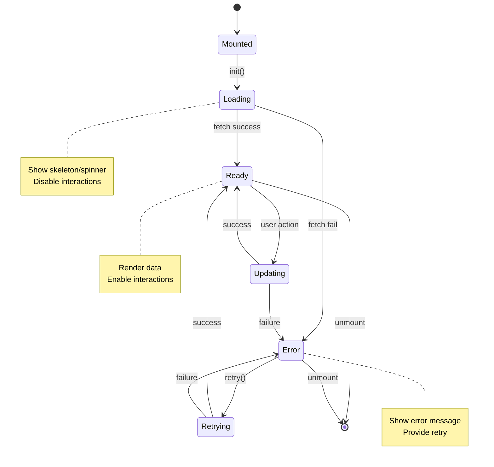

# Component State Diagrams — Quick Workflow

Create Mermaid state diagrams for component lifecycles (Loading → Ready → Error, etc.).

## Preflight (Windows PowerShell)
// turbo
```powershell
$dir = 'docs/state'
if (!(Test-Path $dir)) { New-Item -ItemType Directory -Path $dir | Out-Null }
```

## Steps
1) Pick a component/page (e.g., `CompanyDashboard`).
2) Create `docs/state/<component-name>-state.mmd`.
3) Start from the template and tailor transitions/notes.

## Template (Mermaid)


## Tips
- Add guards for permissions/feature flags as separate states.
- Use sub‑states if the component has tabs or multi‑step flows.
