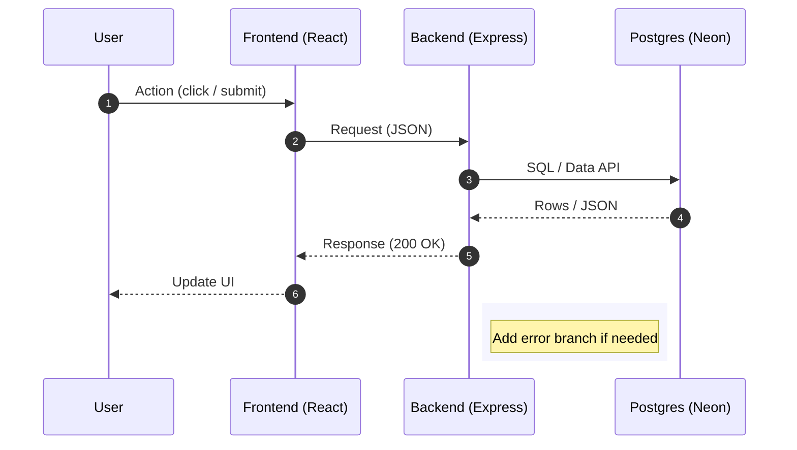

# Sequence Diagrams — Quick Workflow

Create and maintain Mermaid sequence diagrams for any flow (auth, API calls, onboarding, payments, webhooks).

## Preflight (Windows PowerShell)
// turbo
```powershell
$dir = 'docs/diagrams'
if (!(Test-Path $dir)) { New-Item -ItemType Directory -Path $dir | Out-Null }
```

## Steps
1) Pick a name for the diagram (kebab-case), e.g. `auth-flow` or `api-messages`.
2) Create a new file under `docs/diagrams/` with extension `.mmd`.
3) Paste or adapt the template below and edit participants/messages.
4) Commit the file and render it in your docs site or preview in your IDE.

## Template (Mermaid)


## Tips
- Keep participants consistent across diagrams.
- Use `autonumber` for readability.
- Add error branches using `alt`/`else`/`end` if helpful.

## Output
- File saved under `docs/diagrams/<your-name>.mmd`.
