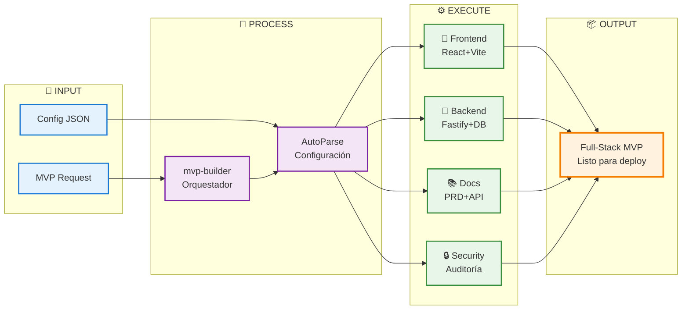

# Flujo de Arquitectura — MVP Workflows

```mermaid
%% Archivo generado desde architecture-flow.mmd
graph LR
  subgraph layer1 ["🏁 INPUT"]
    I1["MVP Request"]
    I2["Config JSON"]
  end

  subgraph layer2 ["🧠 PROCESS"]
    P1["mvp-builder<br/>Orquestador"]
    P2["AutoParse<br/>Configuración"]
  end

  subgraph layer3 ["⚙️ EXECUTE"]
    E1["🎨 Frontend<br/>React+Vite"]
    E2["🔧 Backend<br/>Fastify+DB"] 
    E3["📚 Docs<br/>PRD+API"]
    E4["🔒 Security<br/>Auditoría"]
  end

  subgraph layer4 ["📦 OUTPUT"]
    O1["Full-Stack MVP<br/>Listo para deploy"]
  end

  I1 --> P1
  I2 --> P2
  P1 --> P2
  P2 --> E1
  P2 --> E2
  P2 --> E3
  P2 --> E4
  E1 --> O1
  E2 --> O1
  E3 --> O1
  E4 --> O1

  classDef input fill:#e3f2fd,stroke:#1976d2,stroke-width:2px
  classDef process fill:#f3e5f5,stroke:#7b1fa2,stroke-width:2px  
  classDef execute fill:#e8f5e9,stroke:#388e3c,stroke-width:2px
  classDef output fill:#fff3e0,stroke:#f57c00,stroke-width:3px

  class I1,I2 input
  class P1,P2 process
  class E1,E2,E3,E4 execute
  class O1 output
```
