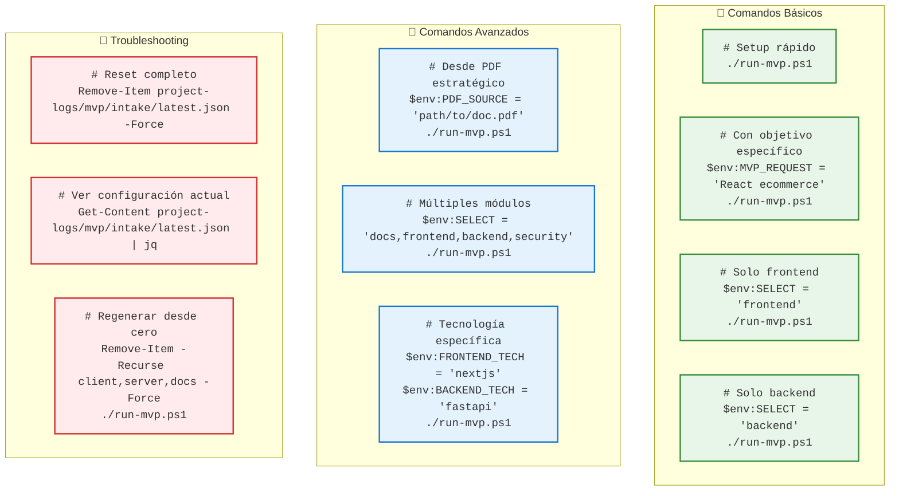

# Referencia de Comandos — MVP Workflows

```mermaid
%% Archivo generado desde commands-reference.mmd
graph TB
  subgraph basic ["🎯 Comandos Básicos"]
    B1["# Setup rápido<br/>./run-mvp.ps1"]
    B2["# Con objetivo específico<br/>$env:MVP_REQUEST = 'React ecommerce'<br/>./run-mvp.ps1"]
    B3["# Solo frontend<br/>$env:SELECT = 'frontend'<br/>./run-mvp.ps1"]
    B4["# Solo backend<br/>$env:SELECT = 'backend'<br/>./run-mvp.ps1"]
  end

  subgraph advanced ["🔧 Comandos Avanzados"]
    A1["# Desde PDF estratégico<br/>$env:PDF_SOURCE = 'path/to/doc.pdf'<br/>./run-mvp.ps1"]
    A2["# Múltiples módulos<br/>$env:SELECT = 'docs,frontend,backend,security'<br/>./run-mvp.ps1"]
    A3["# Tecnología específica<br/>$env:FRONTEND_TECH = 'nextjs'<br/>$env:BACKEND_TECH = 'fastapi'<br/>./run-mvp.ps1"]
  end

  subgraph troubleshoot ["🚨 Troubleshooting"]
    T1["# Reset completo<br/>Remove-Item project-logs/mvp/intake/latest.json -Force"]
    T2["# Ver configuración actual<br/>Get-Content project-logs/mvp/intake/latest.json | jq"]
    T3["# Regenerar desde cero<br/>Remove-Item -Recurse client,server,docs -Force<br/>./run-mvp.ps1"]
  end

  classDef basicStyle fill:#e8f5e9,stroke:#388e3c,stroke-width:2px,font-family:monospace
  classDef advancedStyle fill:#e3f2fd,stroke:#1976d2,stroke-width:2px,font-family:monospace
  classDef troubleStyle fill:#ffebee,stroke:#d32f2f,stroke-width:2px,font-family:monospace

  class B1,B2,B3,B4 basicStyle
  class A1,A2,A3 advancedStyle
  class T1,T2,T3 troubleStyle
```
