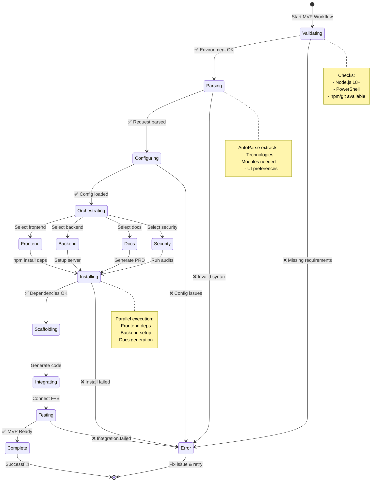

# Estados del Proceso — MVP Workflows

```mermaid
%% Archivo generado desde process-states.mmd
stateDiagram-v2
  [*] --> Validating: Start MVP Workflow

  Validating --> Parsing: ✅ Environment OK
  Validating --> Error: ❌ Missing requirements

  Parsing --> Configuring: ✅ Request parsed
  Parsing --> Error: ❌ Invalid syntax

  Configuring --> Orchestrating: ✅ Config loaded
  Configuring --> Error: ❌ Config issues

  Orchestrating --> Frontend: Select frontend
  Orchestrating --> Backend: Select backend  
  Orchestrating --> Docs: Select docs
  Orchestrating --> Security: Select security

  Frontend --> Installing: npm install deps
  Backend --> Installing: Setup server
  Docs --> Installing: Generate PRD
  Security --> Installing: Run audits

  Installing --> Scaffolding: ✅ Dependencies OK
  Installing --> Error: ❌ Install failed

  Scaffolding --> Integrating: Generate code
  Integrating --> Testing: Connect F+B
  Testing --> Complete: ✅ MVP Ready
  Testing --> Error: ❌ Integration failed

  Error --> [*]: Fix issue & retry
  Complete --> [*]: Success! 🎉

  note right of Validating
    Checks:
    - Node.js 18+
    - PowerShell
    - npm/git available
  end note

  note right of Parsing
    AutoParse extracts:
    - Technologies
    - Modules needed  
    - UI preferences
  end note

  note right of Installing
    Parallel execution:
    - Frontend deps
    - Backend setup
    - Docs generation
  end note
```
