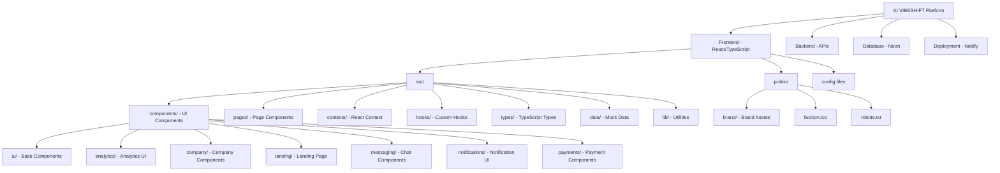
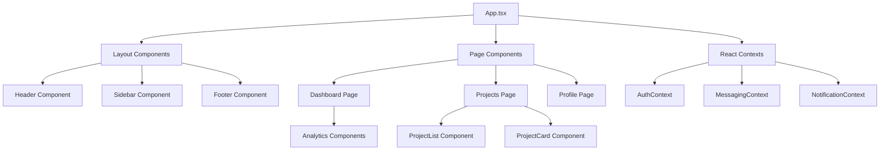
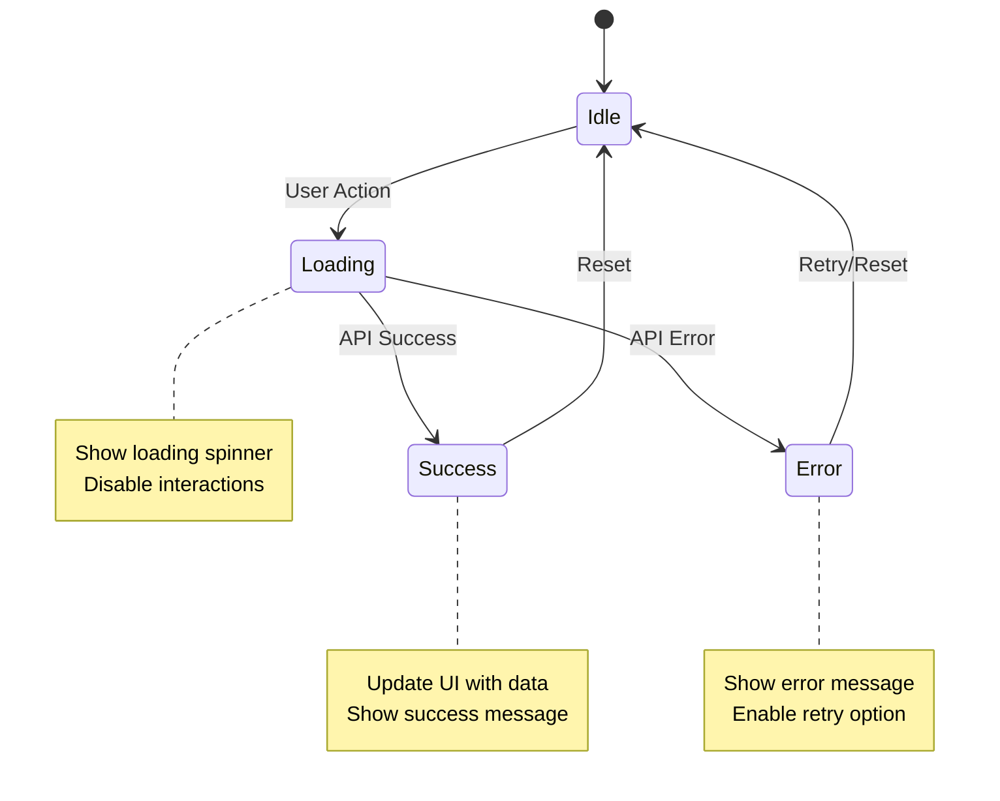
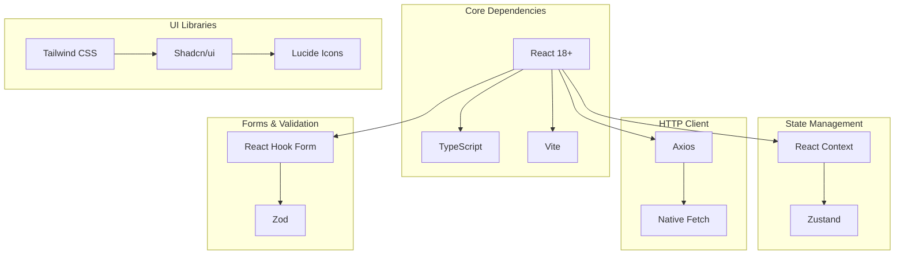

# Documentation — Architecture Diagrams

Genera diagramas visuales completos de la arquitectura del sistema usando Mermaid, incluyendo estructura del proyecto, flujo de datos y relaciones entre componentes.

Related: `/documentation/component-docs`, `/documentation/api-docs`, `/documentation/data-flow-diagrams`

## Objetivo
Crear documentación visual completa de la arquitectura con:
- Diagrama de estructura del proyecto
- Arquitectura de componentes React
- Flujo de datos y estado
- Arquitectura de API y servicios
- Relaciones entre módulos

## Entradas
- Estructura del proyecto: `src/`, `public/`, `scripts/`
- Archivos de configuración: `package.json`, `vite.config.ts`, etc.
- Documentos existentes: `ARCHITECTURE.md`, `API.md`

## Preflight (Windows PowerShell) — seguro para auto‑ejecutar
// turbo
```powershell
$paths = @('docs/diagrams','docs/architecture','project-logs/diagrams')
$paths | ForEach-Object { if (!(Test-Path $_)) { New-Item -ItemType Directory -Path $_ | Out-Null } }
```

## Pasos

### 1) Análisis de Arquitectura del Proyecto
Escanea la estructura completa para identificar:
- Arquitectura general (Vite + React + TypeScript)
- Estructura de carpetas y módulos
- Dependencias principales
- Configuraciones críticas

### 2) Diagrama de Estructura del Proyecto
Genera diagrama jerárquico completo:


### 3) Diagrama de Arquitectura de Componentes
Muestra jerarquía y relaciones entre componentes:


### 4) Diagrama de Flujo de Datos
Ilustra cómo fluyen los datos en la aplicación:

```mermaid
flowchart TD
    User[👤 User] --> UI[🎨 UI Components]
    UI --> Actions[⚡ Actions/Events]
    Actions --> Context[📱 React Context]
    Context --> API[🌐 API Calls]
    API --> Backend[⚙️ Backend Services]
    Backend --> Database[(💾 Database)]

    Database --> Backend
    Backend --> API
    API --> Context
    Context --> UI
    UI --> User

    Context -.-> LocalStorage[(💻 Local Storage)]
    Context -.-> SessionStorage[(📋 Session Storage)]
```


### 5) Diagrama de Arquitectura de Estado
Muestra gestión de estado global:


### 6) Diagrama de Dependencias
Muestra relaciones entre módulos y paquetes:


## Artefactos
- `docs/diagrams/project-structure.md` — Estructura del proyecto
- `docs/diagrams/component-architecture.md` — Arquitectura de componentes
- `docs/diagrams/data-flow.md` — Flujo de datos
- `docs/diagrams/state-management.md` — Gestión de estado
- `docs/diagrams/dependencies.md` — Dependencias del proyecto
- `docs/architecture/README.md` — Documento principal de arquitectura
- `project-logs/diagrams/architecture-analysis.json` — Análisis técnico

## Status JSON (ejemplo)
```json
{
  "diagramsGenerated": 5,
  "totalComponents": 74,
  "architectureLayers": 4,
  "dataFlowsMapped": 12,
  "dependenciesAnalyzed": 15,
  "status": "completed",
  "artifacts": [
    "docs/diagrams/project-structure.md",
    "docs/diagrams/component-architecture.md",
    "docs/diagrams/data-flow.md"
  ],
  "timestamp": "${ISO_TIMESTAMP}"
}
```

## Aceptación (Done)
- Diagramas Mermaid funcionales y legibles
- Cobertura completa de la arquitectura
- Relaciones claras entre componentes
- Flujo de datos documentado
- Dependencias mapeadas

## Dry‑run
- `--dryRun` genera previews sin crear archivos
- Valida sintaxis Mermaid antes de guardar
