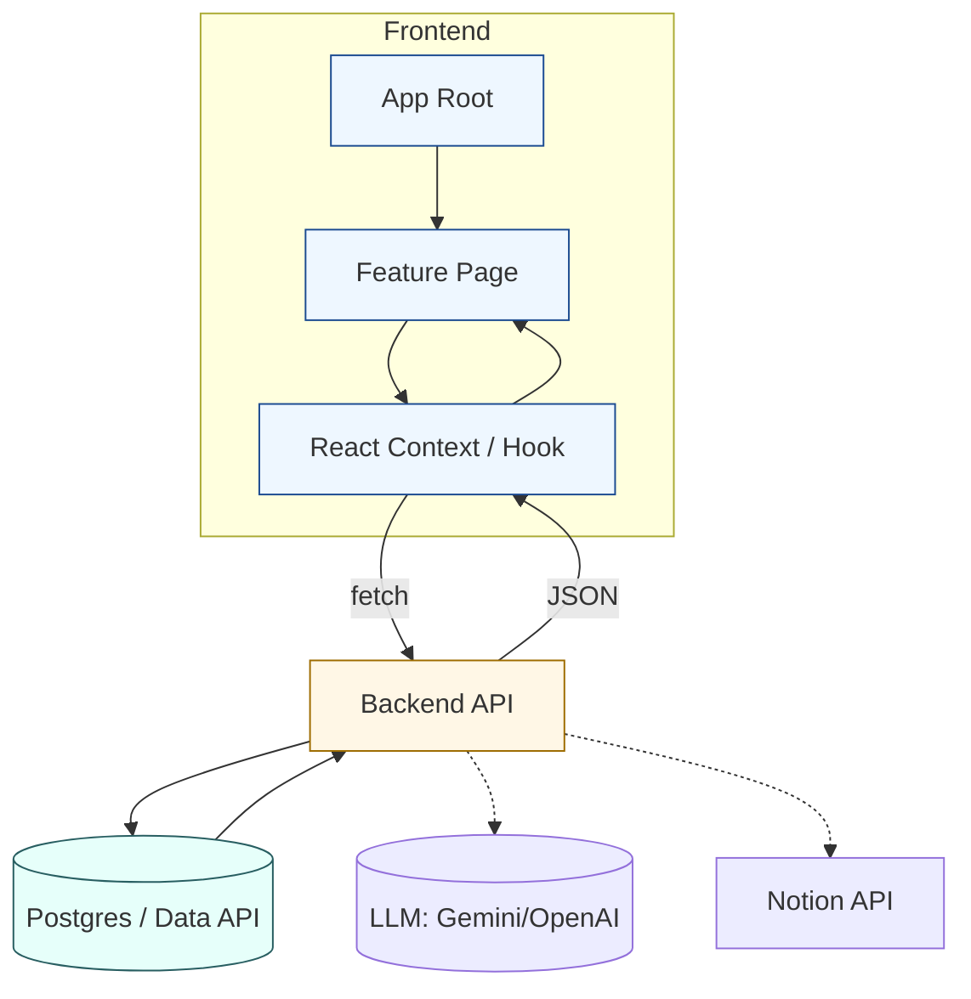

# Data Flow Diagrams — Quick Workflow

Create Mermaid flowcharts to visualize how data moves across UI, Contexts, API, and DB.

## Preflight (Windows PowerShell)
// turbo
```powershell
$dirs = @('docs/data-flow','project-logs/data-flow')
$dirs | ForEach-Object { if (!(Test-Path $_)) { New-Item -ItemType Directory -Path $_ | Out-Null } }
```

## Steps
1) Pick a name (kebab-case), e.g. `messaging-flow` or `notifications-flow`.
2) Create `docs/data-flow/<name>.mmd`.
3) Start from the template and adapt nodes/edges to your case.

## Template (Mermaid)


## Tips
- Keep arrows directional according to real request/response.
- Use subgraphs to group areas (UI/API/DB/External).
- Add notes for caching, retries, and error paths.
