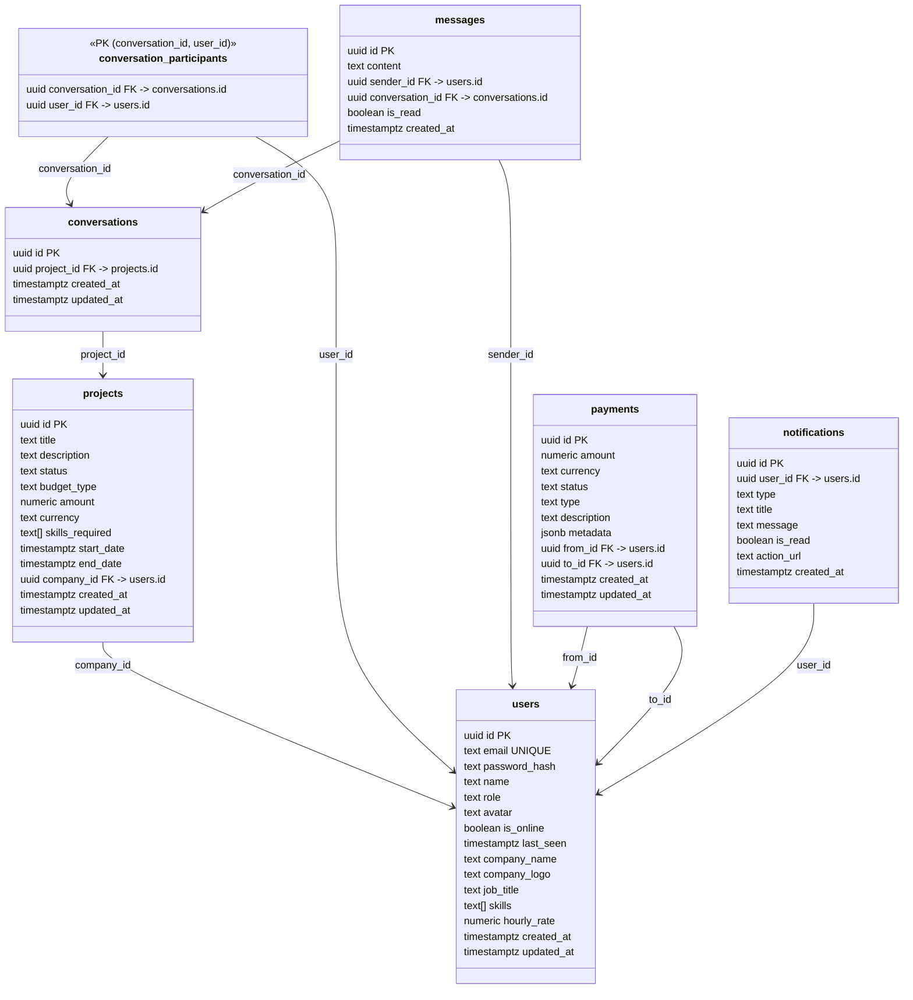

# ERD from SQL — Quick Workflow

Create a Mermaid ERD based on your Postgres schema (tables, PKs/FKs). Works great with files like `scripts/neon/schema.sql`.

## Preflight (Windows PowerShell)
// turbo
```powershell
$dir = 'docs/diagrams'
if (!(Test-Path $dir)) { New-Item -ItemType Directory -Path $dir | Out-Null }
```

## Steps (Semi‑auto)
1) Open `scripts/neon/schema.sql`.
2) Identify tables, primary keys, and foreign keys.
3) Create `docs/diagrams/erd.mmd` and paste the template below.
4) Add classes for each table (attributes as fields) and relations for FKs.

## Template (Mermaid classDiagram)


## Tips
- Use `<<PK>>` to annotate composite primary keys.
- Keep field types to help future readers.
- If schema changes, update this file and commit with the same PR as the migration.
