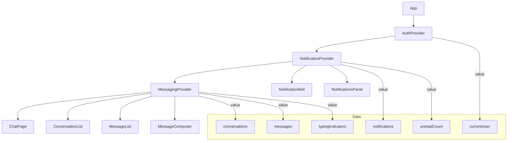

# Props & Context Flow — Quick Workflow

Map how data and handlers flow across providers and components.

## Preflight (Windows PowerShell)
// turbo
```powershell
$dir = 'docs/data-flow'
if (!(Test-Path $dir)) { New-Item -ItemType Directory -Path $dir | Out-Null }
```

## Steps
1) Pick a feature (e.g., `messaging` or `notifications`).
2) Create `docs/data-flow/<feature>-props.mmd`.
3) Use the template to map providers, components, and data/handlers.

## Template (Mermaid)


## Tips
- Use dashed arrows for optional dependencies.
- Add notes for memoization or heavy computations.
