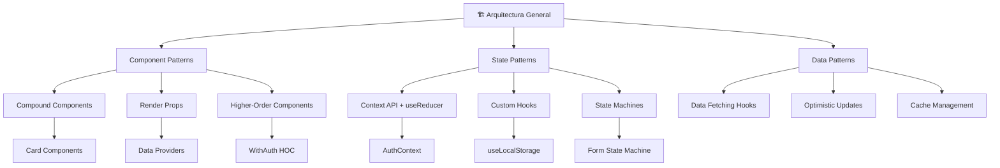

# Documentation — Design Patterns & Best Practices

Documenta los patrones de diseño, mejores prácticas y estándares de código utilizados en el proyecto.

Related: `/documentation/component-docs`, `/documentation/architecture-diagrams`

## Objetivo
Crear documentación completa de patrones con:
- Patrones de diseño implementados
- Mejores prácticas de código
- Estándares de arquitectura
- Guías de desarrollo

## Entradas
- Código fuente: `src/`
- Configuraciones: `eslint.config.js`, `tsconfig.json`
- Estructura de componentes: `src/components/`
- Contextos y hooks: `src/contexts/`, `src/hooks/`

## Preflight (Windows PowerShell) — seguro para auto‑ejecutar
// turbo
```powershell
$paths = @('docs/patterns','docs/best-practices','project-logs/patterns')
$paths | ForEach-Object { if (!(Test-Path $_)) { New-Item -ItemType Directory -Path $_ | Out-Null } }
```

## Pasos

### 1) Análisis de Patrones de Diseño
Identifica patrones implementados:
- **Component Patterns**: Compound Components, Render Props, HOCs
- **State Patterns**: Context API, Custom Hooks, State Machines
- **Data Patterns**: Custom Hooks, Data Fetching, Caching
- **Architecture Patterns**: Container/Presentational, Feature Folders

### 2) Documentación de Patrones de Componentes
Crea documentación para cada patrón identificado:

#### Compound Components Pattern
```markdown
## Compound Components Pattern

### Descripción
Permite componentes relacionados trabajar juntos implícitamente, compartiendo estado interno.

### Ejemplo Implementado
```tsx
// Card.tsx - Componente compuesto
const Card = ({ children }: { children: React.ReactNode }) => (
  <div className="card">{children}</div>
);

const CardHeader = ({ children }: { children: React.ReactNode }) => (
  <div className="card-header">{children}</div>
);

const CardBody = ({ children }: { children: React.ReactNode }) => (
  <div className="card-body">{children}</div>
);

const CardFooter = ({ children }: { children: React.ReactNode }) => (
  <div className="card-footer">{children}</div>
);

// Uso
<Card>
  <CardHeader>
    <h3>Título de la Card</h3>
  </CardHeader>
  <CardBody>
    <p>Contenido de la card</p>
  </CardBody>
  <CardFooter>
    <Button>Acción</Button>
  </CardFooter>
</Card>
```

### Beneficios
- API más limpia y expresiva
- Mejor composición de componentes
- Estado compartido implícito
```

#### Custom Hooks Pattern
```markdown
## Custom Hooks Pattern

### Descripción
Extrae lógica reutilizable de componentes en hooks personalizados.

### Ejemplo: useLocalStorage
```tsx
// hooks/useLocalStorage.ts
const useLocalStorage = <T>(key: string, initialValue: T) => {
  const [storedValue, setStoredValue] = useState<T>(() => {
    try {
      const item = window.localStorage.getItem(key);
      return item ? JSON.parse(item) : initialValue;
    } catch (error) {
      return initialValue;
    }
  });

  const setValue = (value: T | ((val: T) => T)) => {
    try {
      const valueToStore = value instanceof Function ? value(storedValue) : value;
      setStoredValue(valueToStore);
      window.localStorage.setItem(key, JSON.stringify(valueToStore));
    } catch (error) {
      console.error(error);
    }
  };

  return [storedValue, setValue] as const;
};

// Uso en componente
const [user, setUser] = useLocalStorage('user', null);
```
```

### 3) Diagrama de Patrones de Arquitectura
Visualiza patrones implementados:


### 4) Mejores Prácticas de Código
Documenta estándares del proyecto:

#### Naming Conventions
```markdown
## Convenciones de Nombres

### Componentes
- PascalCase para nombres de componentes: `UserProfile`, `ProjectCard`
- camelCase para instancias: `userProfile`, `projectCard`

### Hooks
- Prefijo `use`: `useAuth`, `useLocalStorage`, `useApi`
- camelCase después del prefijo

### Tipos y Interfaces
- PascalCase: `User`, `Project`, `ApiResponse`
- Prefijos descriptivos: `CreateUserRequest`, `UserResponse`

### Archivos
- kebab-case para archivos: `user-profile.tsx`, `project-card.tsx`
- index.ts para exports principales
```

#### File Organization
```markdown
## Organización de Archivos

### Estructura Recomendada
```
src/
├── components/
│   ├── ui/           # Componentes base reutilizables
│   ├── features/     # Componentes específicos de features
│   └── layouts/      # Componentes de layout
├── hooks/            # Custom hooks
├── contexts/         # React contexts
├── types/            # TypeScript type definitions
├── lib/              # Utilidades y configuraciones
└── styles/           # Estilos globales
```

### Principios
- Un componente por archivo
- Tipos relacionados en archivos separados
- Utilidades en `lib/` con barrel exports
- Contextos en archivos dedicados
```

### 5) Patrones de Estado y Gestión de Datos
Documenta estrategias de state management:

#### Context + useReducer Pattern
```typescript
## Context + useReducer Pattern

### Descripción
Combina Context API con useReducer para state management complejo.

### Implementación
```tsx
// types/auth.ts
type AuthState = {
  user: User | null;
  isAuthenticated: boolean;
  loading: boolean;
};

// context/AuthContext.tsx
const AuthContext = createContext<AuthContextType | undefined>(undefined);

const authReducer = (state: AuthState, action: AuthAction): AuthState => {
  switch (action.type) {
    case 'LOGIN_START':
      return { ...state, loading: true };
    case 'LOGIN_SUCCESS':
      return {
        ...state,
        user: action.payload,
        isAuthenticated: true,
        loading: false
      };
    case 'LOGOUT':
      return {
        user: null,
        isAuthenticated: false,
        loading: false
      };
    default:
      return state;
  }
};
```
```

### 6) Guías de Desarrollo
Crea guías prácticas:

#### Code Review Checklist
- [ ] Componentes siguen patrones establecidos
- [ ] Props correctamente tipadas
- [ ] Estado gestionado apropiadamente
- [ ] Efectos secundarios manejados correctamente
- [ ] Tests incluidos para lógica compleja

#### Performance Guidelines
- Usar `React.memo` para componentes caros
- Implementar `useMemo` para cálculos costosos
- Optimizar re-renders con `useCallback`
- Lazy loading para rutas grandes

## Artefactos
- `docs/patterns/component-patterns.md` — Patrones de componentes
- `docs/patterns/state-patterns.md` — Patrones de estado
- `docs/patterns/architecture-patterns.md` — Patrones de arquitectura
- `docs/best-practices/coding-standards.md` — Estándares de código
- `docs/best-practices/development-guide.md` — Guía de desarrollo
- `project-logs/patterns/analysis.json` — Análisis de patrones

## Status JSON (ejemplo)
```json
{
  "patternsIdentified": 12,
  "componentPatterns": 5,
  "statePatterns": 4,
  "architecturePatterns": 3,
  "bestPractices": 8,
  "codeExamples": 15,
  "status": "completed",
  "artifacts": [
    "docs/patterns/component-patterns.md",
    "docs/best-practices/coding-standards.md"
  ],
  "timestamp": "${ISO_TIMESTAMP}"
}
```

## Aceptación (Done)
- Todos los patrones principales documentados
- Ejemplos de código funcionales incluidos
- Mejores prácticas claramente definidas
- Guías de desarrollo completas
- Diagramas de arquitectura de patrones

## Dry‑run
- `--dryRun` analiza código sin generar documentación
- Muestra patrones encontrados y faltantes
