# User Flows — All Paths (Complete Journey Map)

Create Mermaid user flow diagrams showing ALL possible paths for each user journey in VIBESHIFT AI Forge, including success, error, and alternative scenarios.

## Preflight (Windows PowerShell)
// turbo
```powershell
$dir = 'docs/diagrams/user-flows'
if (!(Test-Path $dir)) { New-Item -ItemType Directory -Path $dir | Out-Null }
```

## Steps
1) Pick a user journey (e.g. `registration-flow` or `project-creation-flow`).
2) Create `docs/diagrams/user-flows/<journey-name>.mmd`.
3) Use the comprehensive template below that includes all paths.

## Complete User Flow Template (All Paths)

```mermaid
flowchart TD
    %% Start
    Start([User visits app]) --> AuthCheck{Is authenticated?}
    
    %% Authentication Flow
    AuthCheck -->|No| LoginPage[Login Page]
    LoginPage --> LoginForm{Login Form}
    LoginForm -->|Submit| AuthAPI[POST /api/auth/login]
    AuthAPI -->|200 OK| AuthSuccess[Authentication Success]
    AuthAPI -->|401/403| AuthError[Authentication Error]
    AuthAPI -->|Network Error| AuthNetwork[Network Error]
    
    AuthSuccess --> RoleCheck{User Role?}
    AuthError --> LoginForm
    AuthNetwork --> RetryAuth[Retry Login]
    RetryAuth --> LoginForm
    RetryAuth -->|Give Up| Start
    
    %% Role-Based Dashboard
    RoleCheck -->|Company| CompanyDashboard[Company Dashboard]
    RoleCheck -->|Developer| DeveloperDashboard[Developer Dashboard]
    RoleCheck -->|Admin| AdminDashboard[Admin Dashboard]
    
    %% Company User Flows
    CompanyDashboard --> CompanyActions{Choose Action}
    CompanyActions -->|View Projects| ViewProjects[List My Projects]
    CompanyActions -->|Create Project| CreateProjectForm[Create Project Form]
    CompanyActions -->|View Messages| CompanyMessages[View Conversations]
    CompanyActions -->|View Payments| CompanyPayments[View Payments]
    CompanyActions -->|AI Diagnostic| AIDiagnosticForm[AI Diagnostic Form]
    
    %% Developer User Flows
    DeveloperDashboard --> DevActions{Choose Action}
    DevActions -->|Browse Projects| BrowseProjects[Project Listings]
    DevActions -->|View Applied| MyApplications[My Applications]
    DevActions -->|View Messages| DevMessages[View Conversations]
    DevActions -->|View Payments| DevPayments[View Payments]
    DevActions -->|Profile| DevProfile[Edit Profile]
    
    %% Admin User Flows
    AdminDashboard --> AdminActions{Choose Action}
    AdminActions -->|Manage Users| UserManagement[User Management]
    AdminActions -->|System Settings| SystemSettings[System Settings]
    AdminActions -->|Reports| AdminReports[View Reports]
    
    %% Project Creation Flow (Company)
    CreateProjectForm --> ProjectValidation{Validate Input}
    ProjectValidation -->|Valid| ProjectAPI[POST /api/projects]
    ProjectValidation -->|Invalid| CreateProjectForm
    ProjectAPI -->|201 Created| ProjectSuccess[Project Created]
    ProjectAPI -->|400/422| ProjectError[Project Error]
    ProjectAPI -->|500| ProjectServerError[Server Error]
    ProjectSuccess --> CompanyDashboard
    ProjectError --> CreateProjectForm
    ProjectServerError --> RetryProject[Retry Create]
    RetryProject --> CreateProjectForm
    
    %% Browse Projects Flow (Developer)
    BrowseProjects --> FilterProjects{Apply Filters?}
    FilterProjects -->|Yes| FilterForm[Filter Form]
    FilterProjects -->|No| ProjectList[Project Listings]
    FilterForm --> ProjectList
    ProjectList --> SelectProject{Select Project}
    SelectProject -->|View Details| ProjectDetails[Project Details]
    SelectProject -->|Apply| ApplyForm[Apply Form]
    ProjectDetails --> ApplyForm
    ApplyForm --> ApplyValidation{Validate Application}
    ApplyValidation -->|Valid| ApplyAPI[POST /api/projects/:id/apply]
    ApplyValidation -->|Invalid| ApplyForm
    ApplyAPI -->|201 Applied| ApplySuccess[Application Submitted]
    ApplyAPI -->|409 Already Applied| ApplyDuplicate[Already Applied]
    ApplyAPI -->|403 Not Eligible| ApplyIneligible[Not Eligible]
    ApplySuccess --> MyApplications
    ApplyDuplicate --> ProjectList
    ApplyIneligible --> ProjectList
    
    %% Messaging Flow (All Roles)
    CompanyMessages --> ConversationList[List Conversations]
    DevMessages --> ConversationList
    ConversationList --> SelectConv{Select Conversation}
    SelectConv -->|New Conversation| NewConvForm[New Conversation Form]
    SelectConv -->|Existing| MessageView[Message View]
    NewConvForm --> ConvValidation{Validate}
    ConvValidation -->|Valid| ConvAPI[POST /api/conversations]
    ConvValidation -->|Invalid| NewConvForm
    ConvAPI -->|201 Created| MessageView
    ConvAPI -->|400| ConvError[Error]
    ConvError --> NewConvForm
    
    MessageView --> SendMessage{Send Message?}
    SendMessage -->|Yes| MessageForm[Compose Message]
    SendMessage -->|No| ReadMessages[Read Messages]
    MessageForm --> MessageValidation{Validate}
    MessageValidation -->|Valid| MessageAPI[POST /api/messages]
    MessageValidation -->|Invalid| MessageForm
    MessageAPI -->|201 Sent| MessageView
    MessageAPI -->|400| MessageError[Error]
    MessageError --> MessageForm
    
    %% AI Diagnostic Flow
    AIDiagnosticForm --> URLInput{Enter Company URL}
    URLInput -->|Submit| DiagnosticAPI[POST /api/diagnostic/analyze]
    DiagnosticAPI -->|200 OK| DiagnosticResult[Show Results]
    DiagnosticAPI -->|400 Invalid URL| DiagnosticError[Invalid URL Error]
    DiagnosticAPI -->|429 Rate Limited| DiagnosticRateLimit[Rate Limit Error]
    DiagnosticAPI -->|500 LLM Error| DiagnosticLLMError[LLM Error]
    DiagnosticResult --> DownloadReport{Download Report?}
    DownloadReport -->|Yes| ReportDownload[Generate & Download]
    DownloadReport -->|No| AIDiagnosticForm
    DiagnosticError --> AIDiagnosticForm
    DiagnosticRateLimit --> WaitRetry[Wait & Retry]
    WaitRetry --> AIDiagnosticForm
    DiagnosticLLMError --> RetryDiagnostic[Retry Later]
    RetryDiagnostic --> AIDiagnosticForm
    
    %% Payment Flow
    CompanyPayments --> PaymentList[List Payments]
    DevPayments --> PaymentList
    PaymentList --> SelectPayment{Select Payment}
    SelectPayment -->|View Details| PaymentDetails[Payment Details]
    SelectPayment -->|Dispute| DisputeForm[Dispute Form]
    PaymentDetails --> DisputeForm
    DisputeForm --> DisputeAPI[POST /api/payments/:id/dispute]
    DisputeAPI -->|201 Submitted| DisputeSuccess[Dispute Submitted]
    DisputeAPI -->|400| DisputeError[Error]
    DisputeSuccess --> PaymentList
    DisputeError --> DisputeForm
    
    %% Profile Management (Developer)
    DevProfile --> ProfileForm[Edit Profile Form]
    ProfileForm --> ProfileValidation{Validate}
    ProfileValidation -->|Valid| ProfileAPI[PATCH /api/users/:id]
    ProfileValidation -->|Invalid| ProfileForm
    ProfileAPI -->|200 Updated| ProfileSuccess[Profile Updated]
    ProfileAPI -->|400| ProfileError[Error]
    ProfileSuccess --> DeveloperDashboard
    ProfileError --> ProfileForm
    
    %% Admin Flows
    UserManagement --> UserList[List Users]
    UserList --> SelectUser{Select User}
    SelectUser -->|Edit| EditUserForm[Edit User Form]
    SelectUser -->|Suspend| SuspendUser[Suspend User]
    EditUserForm --> UserValidation{Validate}
    UserValidation -->|Valid| UserAPI[PATCH /api/users/:id]
    UserValidation -->|Invalid| EditUserForm
    UserAPI -->|200 Updated| UserSuccess[User Updated]
    UserAPI -->|400| UserError[Error]
    UserSuccess --> UserList
    UserError --> EditUserForm
    SuspendUser --> SuspendAPI[POST /api/users/:id/suspend]
    SuspendAPI -->|200 Suspended| SuspendSuccess[User Suspended]
    SuspendAPI -->|400| SuspendError[Error]
    SuspendSuccess --> UserList
    SuspendError --> SuspendUser
    
    %% Logout Flow
    CompanyDashboard --> Logout[Logout]
    DeveloperDashboard --> Logout
    AdminDashboard --> Logout
    Logout --> LogoutAPI[POST /api/auth/logout]
    LogoutAPI -->|200 OK| LogoutSuccess[Logged Out]
    LogoutAPI -->|Error| LogoutError[Logout Error]
    LogoutSuccess --> Start
    LogoutError --> Logout
    
    %% Error Handling
    AuthCheck -->|Yes| RoleCheck
    AuthCheck -->|Error| AuthFallback[Fallback to Login]
    AuthFallback --> LoginPage
    
    %% Styling
    classDef start fill:#e8f5e8,stroke:#2e7d32,stroke-width:2px
    classDef page fill:#f3e5f5,stroke:#7b1fa2,stroke-width:1px
    classDef form fill:#fff3e0,stroke:#f57c00,stroke-width:1px
    classDef api fill:#e3f2fd,stroke:#1976d2,stroke-width:1px
    classDef success fill:#e8f5e8,stroke:#2e7d32,stroke-width:1px
    classDef error fill:#ffebee,stroke:#c62828,stroke-width:1px
    classDef decision fill:#fff9c4,stroke:#f9a825,stroke-width:1px
    
    class Start start
    class CompanyDashboard,DeveloperDashboard,AdminDashboard page
    class LoginForm,CreateProjectForm,ApplyForm,MessageForm,AIDiagnosticForm,ProfileForm,EditUserForm,DisputeForm form
    class AuthAPI,ProjectAPI,ApplyAPI,ConvAPI,MessageAPI,DiagnosticAPI,ProfileAPI,UserAPI,SuspendAPI,LogoutAPI api
    class AuthSuccess,ProjectSuccess,ApplySuccess,DisputeSuccess,ProfileSuccess,UserSuccess,SuspendSuccess,LogoutSuccess success
    class AuthError,ProjectError,ApplyDuplicate,ApplyIneligible,ConvError,MessageError,DiagnosticError,DiagnosticRateLimit,DiagnosticLLMError,DisputeError,ProfileError,UserError,SuspendError,LogoutError error
    class AuthCheck,RoleCheck,CompanyActions,DevActions,AdminActions,ProjectValidation,ApplyValidation,ConvValidation,MessageValidation,URLInput,DownloadReport,SelectPayment,ProfileValidation,UserValidation,SendMessage,SelectConv,SelectProject,FilterProjects,SelectUser decision
```


## Tips for All Paths
- Include ALL decision points with multiple outcomes.
- Show error states and recovery paths.
- Use different colors for start (green), pages (purple), forms (orange), APIs (blue), success (green), error (red), decisions (yellow).
- Add notes for specific conditions (e.g., rate limits, validation rules).
- Keep it readable — if too complex, split into separate diagrams per major flow.

## Output
- Complete user journey map saved as `docs/diagrams/user-flows/complete-user-flows.mmd`.
- Can be split into smaller diagrams if needed (one per role or feature).
