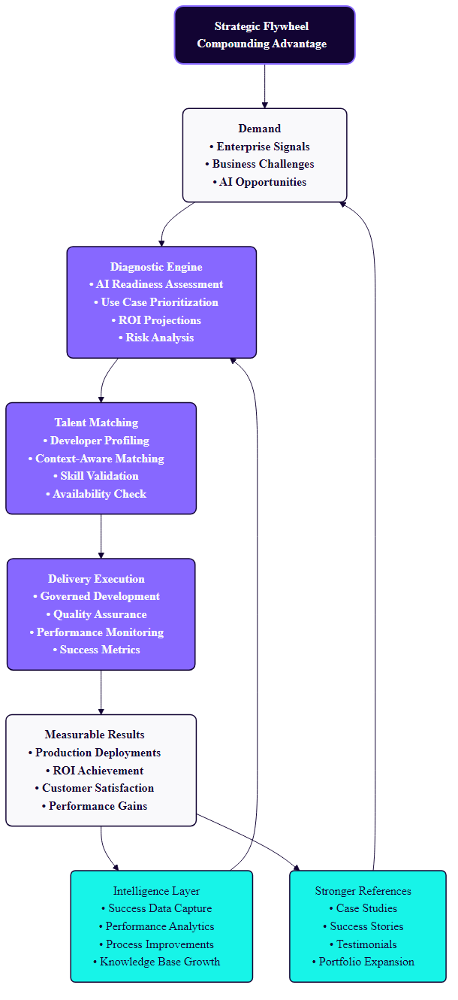
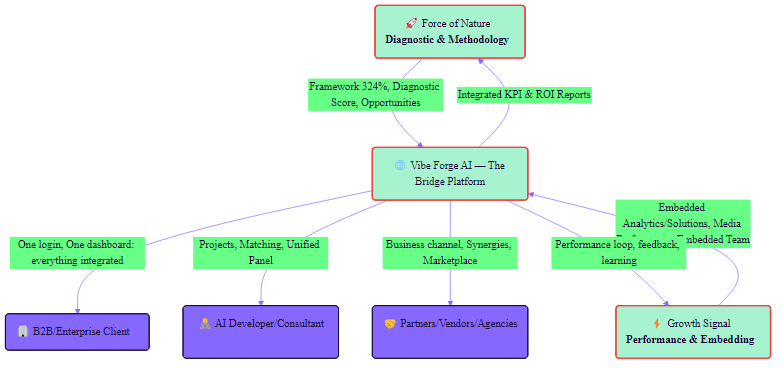
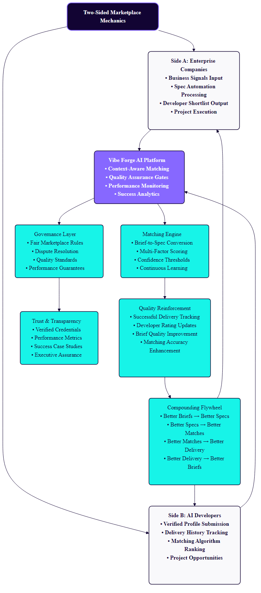
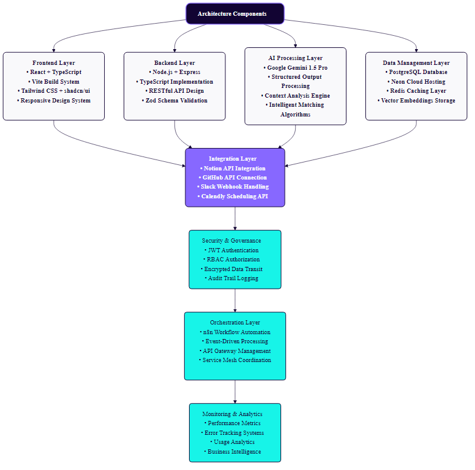
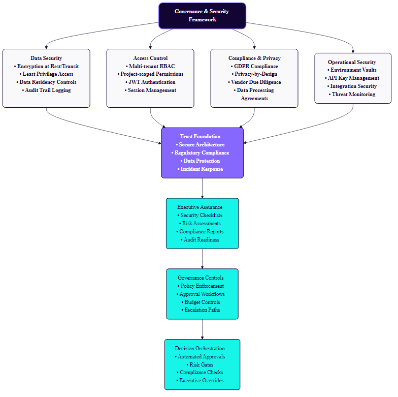

# Vibe Forge AI — Strategic Executive README (Professional Edition, ALT)

> An AI design studio that turns a URL or brief into two executable plans — Client Implementation Plan + Developer Build Plan — with measurable outcomes and a compounding advantage.

---

## At-a-Glance

| Item | Summary |
| --- | --- |
| Value Proposition | Design your application/tool from a URL or brief with AI‑guided workflows that output a Dual‑Plan Artifact: a client implementation plan and a developer build plan |
| Who It’s For | Enterprise leaders, Heads of AI/Engineering, elite AI developers |
| How it works | We analyze your URL/brief using curated workflows → generate a Dual‑Plan Artifact (Client Implementation Plan + Developer Build Plan) → optionally match a best‑fit developer → kick off with tracked milestones |
| What you receive | Dual‑Plan Artifact: (1) Client Implementation Plan (SoW, scope, timeline, KPIs) and (2) Developer Build Plan (architecture snapshot, data model, endpoints, milestones/tasks, dependencies, acceptance criteria) |
| Developer assignment | Optional: approve a shortlist or auto‑assign; fit based on skills, domain, availability, and alignment to the build plan/spec |
| Outcomes | Fast MVP or production plan; repeatable generation of both plans from a description; reduced ambiguity and rework |
| CTA | Companies: share a URL/brief. Developers: apply with delivery history |

## Table of Contents
1. [Executive Summary](#1-executive-summary)
2. [Product Vision](#2-product-vision)
3. [What the Platform Delivers](#3-what-the-platform-delivers)
4. [How It Works (End‑to‑End Motion)](#4-how-it-works-end-to-end-motion)
5. [Strategic Flywheel — Compounding Advantage](#5-strategic-flywheel--compounding-advantage)
6. [Strategic Workflows](#6-strategic-workflows)
7. [Methodology & Diagnostic Framework](#7-methodology--diagnostic-framework)
8. [Two‑Sided Marketplace Mechanics](#8-two-sided-marketplace-mechanics)
9. [Platform Architecture Snapshot](#9-platform-architecture-snapshot)
10. [Governance, Security, and Compliance](#10-governance-security-and-compliance)
11. [MVP Status & Next Steps](#11-mvp-status--next-steps)
12. [Why We Win](#12-why-we-win)
13. [Call to Action](#13-call-to-action)
14. [Appendix: Brand & Presentation](#appendix-brand--presentation)

---

## 1) Executive Summary

- **Problem:** Enterprises know the outcome they want but struggle to translate intent into executable specs; teams stall pre‑build; discovery drags; scope ambiguity causes rework and missed value.
- **Solution:** Vibe Forge AI provides an AI‑guided design studio that produces a Dual‑Plan Artifact (Client Implementation Plan + Developer Build Plan) from a URL/brief; optionally connects to a two‑sided marketplace for governed delivery.
- **Why Now:** Advantage accrues to organizations that compress discovery and execution into a repeatable, data‑driven system with AI‑native workflows, telemetry, and feedback loops.
- **Effect:** Faster time‑to‑plans (SoW + Build Plan) and time‑to‑value; higher production success; reduced rework and scope churn; a compounding flywheel with every delivery.

---

## 2) Product Vision

A **professional bridge** between companies and developers. Vibe Forge AI standardizes how business intent becomes a shared, testable, and governable Dual‑Plan Artifact that directly powers matching and delivery.

- Brief‑to‑Spec Automation
- From URL/brief to a Dual‑Plan Artifact: (1) Client Implementation Plan (SoW, scope, KPIs, timeline) and (2) Developer Build Plan (architecture snapshot, data model, endpoints, milestones/tasks, acceptance criteria, risks, estimates, dependencies).

- Context‑Aware Talent Matching (Two‑Sided Marketplace)
- Shortlists built from verified developer profiles, **multi‑factor matching** (skills, seniority, domain, availability), and **spec fitness** (acceptance criteria and non‑functional requirements).

- Governed Delivery with Telemetry
- **KPIs, portfolio analytics, and compliance guardrails** built‑in — enabling rapid PoCs and an enterprise path to production.

---

## 3) What the Platform Delivers

- **Diagnostic**
- Readiness across key dimensions; 4–6 prioritized use cases with ROI rationale and timelines.

- **Dual‑Plan Output (Spec Automation + Build Plan)**
- Client Implementation Plan (SoW, scope, KPIs, timeline) and Developer Build Plan (architecture snapshot, data model, endpoints, milestones, tasks, acceptance criteria, risks, estimates, dependencies).

- **Talent Shortlist (Marketplace)**
- Top candidates ranked by multi‑factor matching (spec fit, delivery history, domain relevance, availability).

- **Delivery & Governance**
- Execution with KPIs, demos, QA, rollback standards, observability, and audit trails.

---

## 4) How It Works (End‑to‑End Motion)

1) **Signal Intake**
- **Inputs:** company URL, product brief, constraints (tech stack, compliance, timelines).

2) **AI‑Assisted Analysis**
- Scrape and normalize key signals, validate structure, and classify industry/context.

- Automate internal app‑building workflows to generate a Dual‑Plan Artifact from a single input (scaffolded plans, milestones, tasks, and dependencies).

3) **Dual‑Plan Automation (Brief‑to‑Spec + Build Plan)**
- Disambiguate requirements, validate assumptions, define anti‑requirements, map risks and compliance, and produce both a client‑facing implementation plan and a developer build plan with acceptance criteria and KPIs.

4) **Context‑Aware Matching**
- Generate a **ranked shortlist** or **auto‑assign** the best‑fit developer based on policy and context (spec fitness, domain relevance, seniority, availability, delivery references).

### Decision & Orchestration Options (Variants)
- **Assignment Policy**
  - Auto‑assign best‑fit developer when confidence and policy thresholds are met (no shortlist).
  - Assemble a small team (lead + support) when scope requires parallel streams.
  - Route to an agency/partner when specialization or scale is needed.
  - Hold pending legal/procurement gates before assignment.
- **Approval Modes**
  - Client stakeholder one‑click approval via secure link/email: Approve, Request changes, Book call.
  - Multi‑approver workflow (e.g., client stakeholder + Security + Finance) with tracked SLAs.
- **Scheduling & Collaboration**
  - Auto‑schedule with the client stakeholder via Calendly for brief refinement or kick‑off; capture constraints.
  - Open a Slack thread with the client stakeholder and assigned dev(s) for real‑time collaboration.
  - Send email digests; respect the client stakeholder’s preferences (time zone, language) in all communications.
- **Contracting & Payments**
  - NDA e‑signature; generate SoW + MSA for e‑signature.
  - Payment modes: milestone‑based, retainer, time & materials; optional Stripe link for pre‑paid PoC.
  - Purchase Order (PO) creation and budget tracking when required.
- **Risk & Compliance**
  - Security checklist, data residency, and vendor risk review gates.
  - Budget caps and policy thresholds enforced before assignment.
- **Delivery Previews**
  - Sandbox Preview or Digital Twin for the client stakeholder before full build.
  - Clickable prototype and/or A/B deliverable format (doc vs dashboard) options.
- **Feedback & Iteration**
  - In‑app Design Studio co‑pilot to refine spec; regenerate SoW/acceptance criteria on change.
  - Comment threads tied to acceptance criteria with audit trail.
- **Fallback Paths**
  - Pause experiment or re‑scope; swap developer or escalate to solution architect; cancel per policy.

---

## 5) Strategic Flywheel — Compounding Advantage

CEO‑friendly caption: The more we deliver, the better we get. Each cycle strengthens diagnostics, talent matching, delivery quality, and references—feeding demand and accelerating outcomes. This is the compounding advantage engine.

---

## 6) Strategic Workflows

- AI Readiness Diagnostic
  - Produces an 8‑dimension readiness view, prioritized use cases, and a phased roadmap with ROI logic.

- Rapid AI Proof‑of‑Concept
  - Validate hypotheses fast with stakeholder feedback and optional digital‑twin scenarios before scaling. Iterate or pivot based on evidence.

- Enterprise Path to Production
  - From planning and team assembly to integration, launch, and scale with continuous optimization and ROI measurement.

---

## 7) Methodology & Diagnostic Framework

CEO‑friendly caption: A single bridge platform connects enterprise stakeholders, elite AI developers, and partners—standardizing discovery, matching, and delivery with integrated KPIs and feedback loops.

---

## 8) Two‑Sided Marketplace Mechanics

- **Side A (Companies)**
  - Input signals → Spec Automation → developer shortlist with evidence‑based rationale.

- **Side B (Developers)**
  - Verified profiles and delivery history; DX designed for clarity (standardized briefs, testable specs, fewer ambiguities, less rework).

- **Feedback Flywheel**
  - Every delivery strengthens briefs and matching quality: brief → spec → match → deliver → outcomes → improved future specs and rankings.

CEO‑friendly caption: How demand and talent sides interact through the Vibe Forge AI platform: signals in → brief‑to‑spec → shortlist or auto‑assignment → governed delivery → feedback → stronger references → more demand.

---

## 9) Platform Architecture Snapshot

- **Frontend**
  - React + TypeScript + Vite + Tailwind + shadcn/ui (**Vibe Forge AI brand:** Deep Purple #120433, Bright Purple #8768FF, Aqua #17F4E8; fonts: Manrope, JetBrains Mono).

- **Backend**
  - Node/Express + TypeScript; Cheerio scraping; Zod validation; JWT auth; Webhooks for integrations.

- **AI Layer**
  - Google Gemini 1.5 Pro for structured outputs; prompt engineering with schema enforcement and error‑tolerant parsing.

- **Data & Infra**
  - PostgreSQL (Neon) + Redis; S3 file storage; CI/CD ready.

- **Integrations**
  - Notion, GitHub, Slack, Stripe, Calendly, n8n, analytics and error monitoring.

CEO‑friendly caption: A layered architecture connects frontend, backend, AI, and data with integration, security, orchestration, and monitoring for enterprise‑grade delivery.

---

## 10) Governance, Security, and Compliance

- **Data Handling**
  - Least‑privilege access; encryption in transit/at rest; secrets via environment vaults.

- **Access Control**
  - Multi‑tenant RBAC; project‑scoped permissions; audit trails and approvals on key actions.

- **Compliance Posture**
  - Privacy‑by‑design; vendor due diligence; scoped API keys; webhook governance.

CEO‑friendly caption: Governance and security provide the trust foundation—controls, approvals, and risk gates—woven into decision orchestration.

---

## 11) MVP Status & Next Steps

- **MVP Capabilities (Completed)**
  - Dual‑Plan generation from description that produces both a client‑facing plan and a developer‑ready build plan (milestones, tasks, dependencies, acceptance criteria).
  - Domain acquisition: VibeForgeIA.com

- **Next Steps (sequenced, no dates)**
  - Expand spec automation coverage and robustness (validation, error handling).
  - Integrate brief‑aware matching into the marketplace flow.
  - Enable telemetry on time‑to‑SoW and scope churn.
  - Security checklist and approvals gating.
  - Portfolio analytics and onboarding automation.

---

## 12) Why We Win

- **Brief‑aware by design:** specifications become the system of record for matching and delivery, not a side artifact.
- **Measurable governance:** telemetry and feedback loops compound over time.
- **Developer‑first DX:** standardized, testable briefs reduce ambiguity and rework.
- **Enterprise‑ready:** security, compliance, and integrations are built into the core.

---

## 13) Call to Action

- **Companies**
  - Share a URL or short brief. In minutes you’ll receive a structured diagnostic and a draft SoW with acceptance criteria and KPIs. We will propose a shortlist of developers and a start plan.

- **Developers**
  - Apply with your delivery history and domain strengths. Your ranking improves with outcomes. Expect standardized briefs, clear acceptance criteria, and professional governance.

---

## Appendix: Brand & Presentation
- **Brand:** Vibe Forge AI.
- Colors: Deep Purple (#120433), Bright Purple (#8768FF), Aqua (#17F4E8); Neutrals from Light (#F9F9FB) to Dark (#120433); Accents – Success (#3BF45B), Warning (#FFD23C), Error (#E04A4A).
- Typography: Manrope (primary), JetBrains Mono (monospace), Inter/system fallbacks.
- Tone: modern, clean, professional; high‑tech and trustworthy; focused on outcomes and clarity.
