# VIBESHIFT.AI Forge — Executive README (CEO Edition, EN)

> An enterprise platform that turns business signals into measurable AI outcomes: diagnosis → roadmap → talent → production, in days.

## Highlights (for executive decision-making)
- Near‑instant first diagnostic with clear direction.
- Prioritized use cases with ROI rationale and indicative timelines.
- Rapid proof‑of‑concept where feasible to de‑risk and accelerate learning.
- Accelerated delivery to production with end‑to‑end governance.
- Compounding flywheel: every successful delivery improves matching, briefs, and outcomes.

## Table of Contents
1. Executive Summary
2. Strategic Differentiation & Value Multiplication
   - Value Multiplication Matrix (Mermaid)
   - EPIC Ecosystem Network Effect (Mermaid)
   - Why We Win (Moats)
3. How It Works End‑to‑End
   - AI Pipeline (Mermaid)
   - Architecture Snapshot (high level)
   - App & Integrations Flow (Mermaid)
4. The 3 Strategic Workflows
   - AI Readiness Diagnostic (Mermaid)
   - Rapid AI Proof‑of‑Concept Path (Mermaid)
   - Enterprise AI Implementation Path (Mermaid)
5. Outcomes and Evidence
6. 30/60/90 Roadmap
7. Business Model & Interest (Integrations)
8. Call to Action (Next Steps)

---

## 1) Executive Summary
- Problem: Most AI initiatives stall before production; scarce specialized talent and pressure on ROI slow decisions.
- Insight: Success requires a single motion that links diagnosis → team → execution → measurement.
- Solution: VIBESHIFT.AI operationalizes proven playbooks with predictive matching (Vibe Score™) and Digital Twin simulations for confident decisions.
- Why Now: Advantage comes from compressing discovery and execution into a repeatable, data‑driven system.
- Expected Result: Faster time‑to‑value, higher production success, and a compounding ecosystem.

---

## 2) Strategic Differentiation & Value Multiplication
Short: a single platform that connects executive‑grade diagnosis, elite talent, and execution with ROI analytics in one flow. This creates a compounding advantage: more demand → better talent → better delivery → stronger briefs → larger portfolios.

### 2.1 Value Multiplication Matrix
Executive note: shows how the combination of diagnosis + matching + playbooks + automation multiplies value for clients, developers, methodology, and the ecosystem.


### 2.2 EPIC Ecosystem Network Effect
Executive note: illustrates the two‑sided flywheel and how data and partners amplify acquisition, quality, and outcomes. Core to scale and durable moats.

```mermaid
graph TB
     subgraph StrategyCore ["🧠 Strategic Core"]
         Diagnostics[Readiness Diagnostics<br/>📊 Strategy Engine]
         AnalyticsHub[Embedded Analytics<br/>⚡ Growth Insights]
         Leadership[Strategic Steering<br/>🎯 Vision & Governance]
     end
     
     subgraph PlatformLayer ["🤖 AI Platform Layer"]
         NexusAI[VIBESHIFT.AI<br/>🚀 Marketplace]
         OpportunityEngine[Opportunities Engine<br/>🔍 Automated Analysis]
         VibeScore[Vibe Score™<br/>📈 Predictive Matching]
     end
     
     subgraph EcosystemPartners ["🌍 Ecosystem Partners"]
         Enterprises[Enterprise Clients<br/>💼]
         Developers[Elite AI Developers<br/>👩‍💻]
         Agencies[Partner Agencies<br/>🤝]
         Consultants[Certified Consultants<br/>🎓]
     end
     
     subgraph DataIntelligence ["📊 Intelligence Layer"]
         Notion[Notion Knowledge Base<br/>📝 Centralized Docs]
         Analytics[Real-time Analytics<br/>📊 Performance Data]
         AI[OpenAI + Gemini<br/>🧠 AI Processing]
         Automation[n8n Automations<br/>⚙️ Workflow Engine]
     end
     
     Leadership --> Diagnostics
     Leadership --> AnalyticsHub
     Diagnostics --> OpportunityEngine
     AnalyticsHub --> VibeScore
     OpportunityEngine --> NexusAI
     VibeScore --> NexusAI
     
     NexusAI --> Enterprises
     NexusAI --> Developers
     NexusAI --> Agencies
     NexusAI --> Consultants
     
     Enterprises -.->|"Business Signals"| Analytics
     Developers -.->|"Success Stories"| Diagnostics
     Agencies -.->|"Data Insights"| Analytics
     Consultants -.->|"Methodology Scale"| Leadership
     
     Notion --> OpportunityEngine
     Analytics --> VibeScore
     AI --> NexusAI
     Automation --> StrategyCore
     
     classDef core fill:#120433,stroke:#8768FF,color:#ffffff
     classDef platform fill:#8768FF,stroke:#120433,color:#ffffff
     classDef ecosystem fill:#17F4E8,stroke:#120433,color:#120433
     classDef data fill:#F9F9FB,stroke:#120433,color:#120433
     
     class Leadership,Diagnostics,AnalyticsHub core
     class NexusAI,OpportunityEngine,VibeScore platform
     class Enterprises,Developers,Agencies,Consultants ecosystem
     class Notion,Analytics,AI,Automation data
```



### 2.3 Why We Win (Moats)
- Data network effects: performance telemetry and outcomes compound over time.
VIBESHIFT.AI to daily workflows.- Methodology IP: proven playbooks embedded into productized workflows.
- Two‑sided marketplace: quality lock‑in via reputation and Vibe Score™.
- Switching costs: briefs, analytics, and roadmaps live in VIBESHIFT.AI.
- Integration surface: Notion, cloud providers, and automation connect 

---

## 3) How It Works End‑to‑End
Short: from a URL or brief, we generate readiness insights and prioritized use cases, produce a phased roadmap (near‑term wins and strategic builds), match elite talent, and execute with ROI analytics.

### 3.1 AI Pipeline (signal → insight)
Executive note: ensures structured, reliable outputs from scraping to visualization, with validation, sanitization, and end‑to‑end error handling.


### 3.2 Architecture Snapshot (high level)
- Frontend: React + TypeScript + Tailwind + shadcn/ui.
- Backend: Node/Express + TypeScript; Cheerio for scraping; Zod for validation.
- AI: Google Gemini 1.5 Pro (structured outputs).
- Data: PostgreSQL (Neon) + Redis; JWT auth.
- Integrations: Notion, GitHub, Slack, Stripe, Calendly.

### 3.3 App & Integrations Flow (Mermaid)
Executive note: how users and apps connect to the platform core (auth, data, AI/logic, API, automation) and to external integrations. Shows we can integrate securely and at scale with minimal operational friction.

```mermaid
flowchart TD
  %% Frontend Apps
  subgraph Users & Apps
    User[👤 Client User]
    Admin[🛠️ Admin]
    Dev[👩‍💻 AI Developer]
    Dashboard[🖥️ Web Dashboard]
    Mobile[📱 Mobile App (Future)]
  end

  %% Platform Core
  subgraph VIBESHIFT.AI Platform
    Auth[🔐 Multi‑tenant Auth]
    DataLayer[(📦 Data Layer)]
    LogicEngine[💡 AI/Logic Engine]
    API[🔗 Universal API Hub]
    Automation[🤖 Automation Orchestrator]
  end

  %% External Integrations
  subgraph External Integrations
    Notion[Notion]
    GitHub[GitHub]
    GoogleAds[Google Ads]
    LinkedIn[LinkedIn]
    Calendly[Calendly]
    Stripe[Stripe]
    Slack[Slack]
    OpenAI[OpenAI API]
    Gemini[Gemini API]
    Zapier[Zapier]
    n8n[n8n]
    S3[Amazon S3]
    Supabase[Supabase/Postgres]
    Mixpanel[Mixpanel]
    Sentry[Sentry]
    Intercom[Intercom]
    Figma[Figma]
    Loom[Loom]
    MS365[Microsoft 365]
    GWorkspace[Google Workspace]
    Others[(More Integrations...)]
  end

  User --"Sign in / Access"--> Auth
  Admin --"Admin Panel"--> Dashboard
  Dev --"Apply / Deliver"--> Dashboard
  Dashboard --"Use services"--> LogicEngine
  Dashboard --"Real‑time data"--> DataLayer
  Mobile --"APIs / Mobile Data"--> API

  LogicEngine --"Automate"--> Automation
  Automation --"Trigger / Sync"--> Zapier
  Automation --"Pro Flows"--> n8n
  API --"API Calls"--> Notion
  API --"API Calls"--> GitHub
  API --"API Calls"--> GoogleAds
  API --"API Calls"--> LinkedIn
  API --"API Calls"--> Calendly
  API --"API Calls"--> Stripe
  API --"API Calls"--> Slack
  API --"AI tasks"--> OpenAI
  API --"AI tasks"--> Gemini
  API --"File Storage"--> S3
  API --"DB Sync"--> Supabase
  API --"User Analytics"--> Mixpanel
  API --"Error Monitoring"--> Sentry
  API --"Support"--> Intercom
  API --"Design"--> Figma
  API --"Video & Demos"--> Loom
  API --"Productivity"--> MS365
  API --"Productivity"--> GWorkspace
  API --"Other SaaS"--> Others

  DataLayer --"Stores Data"--> Supabase
```

---

## 4) The 3 Strategic Workflows

### 4.1 AI Readiness Diagnostic (5 phases)
Executive note: produces an 8‑dimension readiness view, prioritized use cases, and a phased roadmap with ROI rationale — compressing months of discovery.

```mermaid
flowchart TD
    A[Company Input<br/>URL/Description] --> B[Phase 1: Data Extraction<br/>Web Scraping & Content Analysis]
    B --> C[Phase 2: Industry Classification<br/>AI‑Powered Categorization]
    C --> D[Phase 3: Readiness Assessment<br/>8‑Dimension Scoring]
    D --> E[Phase 4: Use Case Generation<br/>AI Recommendations]
    E --> F[Phase 5: Roadmap Creation<br/>Prioritized Implementation Plan]
    F --> G[Output: Diagnostic Report<br/>ROI Projections & Timeline]

    style A fill:#e1f5fe
    style B fill:#f3e5f5
    style C fill:#fff3e0
    style D fill:#e8f5e8
    style E fill:#fce4ec
    style F fill:#f1f8e9
    style G fill:#e3f2fd
```



- Time: compresses discovery dramatically.
- Precision: high‑relevance use cases anchored in business context.
- Deliverables: readiness score, prioritized use cases, ROI rationale, timeline.

### 4.2 Rapid AI Proof‑of‑Concept Path
Executive note: validate hypotheses quickly, de‑risk investment with executive feedback and Digital Twin scenarios before scaling.


- Outcome: validate or iterate quickly; prioritize informed investment.
- Advantage: rapid PoC where appropriate; fast iteration cycles.
- Next: if successful, scale via the enterprise path.

### 4.3 Enterprise AI Implementation Path
Executive note: from planning to deployment and scaling with ROI measurement; integrates matching, project management, and collaboration end‑to‑end.

```mermaid
flowchart TD
    A[Strategic Planning<br/>AI Readiness Diagnostic] --> B[Team Assembly<br/>Talent Marketplace Matching]
    B --> C[Build Phase<br/>Full‑Stack AI Solution]
    C --> D[Integration & Testing<br/>Cross‑Project Validation]
    D --> E[Deployment<br/>Production Launch]
    E --> F[Scaling & Optimization<br/>Performance Monitoring]
    F --> G[Success Measurement<br/>ROI Tracking & Analytics]
```



- Benefits: accelerated delivery; higher probability of production success.
- Decision: executive briefs + ROI analytics.
- Scale: portfolio intelligence and vertical playbooks.

